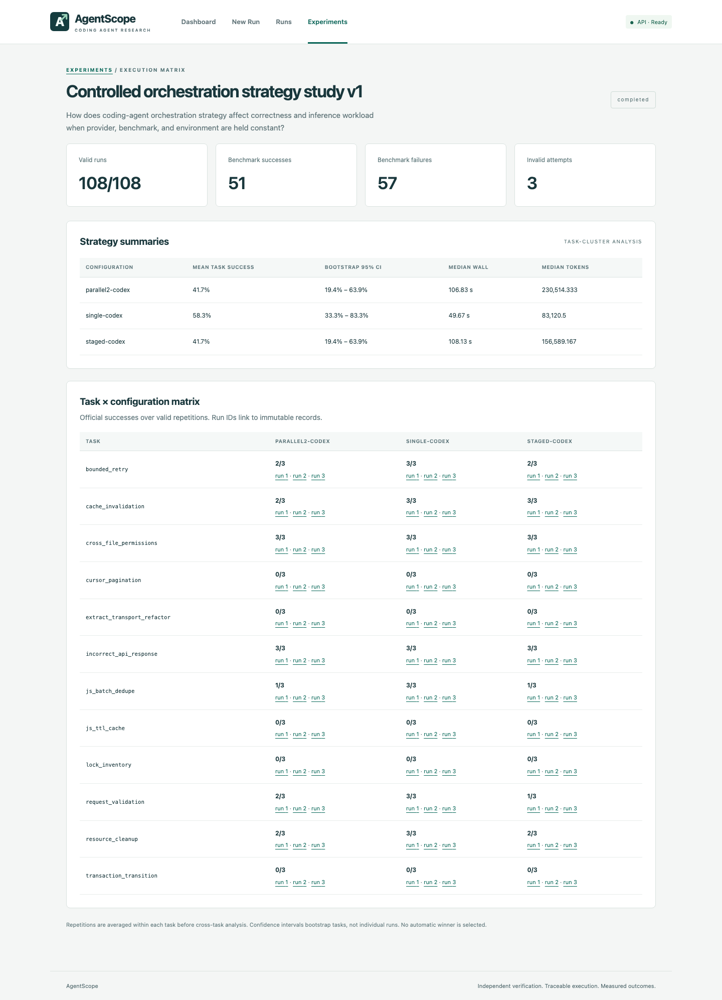
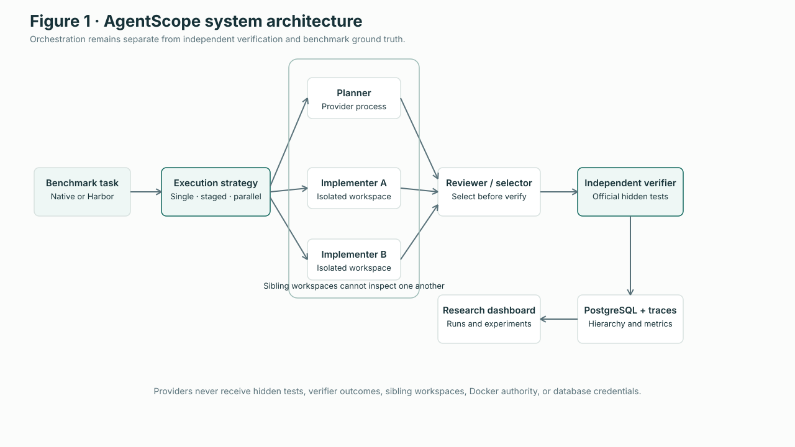

# AgentScope

**Release 1.0.0 · completed research-engineering system**

AgentScope is a research-oriented coding-agent harness for measuring how execution
architecture changes software-engineering correctness and provider workload. It runs
Codex CLI or Claude Code against reproducible repositories, records hierarchical
agent and tool traces, and applies an independent verifier after the candidate patch
is frozen.

It exists to study questions that a model-only benchmark cannot answer: What does a
planning or review stage cost? Do parallel candidates overlap enough to reduce wall
time? How many provider invocations and tool calls does an architecture create? Does
added orchestration change official task success when provider, task, and environment
are held constant?

> AgentScope measures harness-visible provider processes, tokens where available,
> tools, patches, latency, and official verification. It does **not** measure GPU
> utilization, true TTFT/ITL, or inference-server efficiency.

[](docs/images/phase9-strategy-summary.png)

Read the compact systems report: **[AgentScope: Evaluating the Correctness and
Inference-Workload Trade-offs of Coding-Agent Harness Architectures](docs/research-report.md)**.

## What it can do

- Run Codex CLI, Claude Code, or a deterministic mock provider behind capability-aware adapters.
- Execute single-agent, planner → implementer → reviewer, and bounded parallel-implementer strategies.
- Give every candidate an isolated Docker workspace with typed, confined tools.
- Keep hidden tests, reference solutions, sibling workspaces, Docker authority, and database credentials away from agents.
- Select a parallel candidate before running the only official verifier.
- Import current Harbor-style tasks without delegating AgentScope orchestration to Harbor.
- Persist runs, sub-executions, traces, metrics, candidate selection, and experiments in PostgreSQL.
- Schedule resumable, randomized repeated experiments and analyze repetitions at the task level.
- Inspect runs and experiment matrices through FastAPI and a React research dashboard.

## Architecture



The harness owns workspace lifecycle, strategy control, trace ordering, candidate
installation, verification, and cleanup. Providers only receive the role-specific
context and workspace they need. The verifier remains authoritative even when a
reviewer approves a patch.

## Providers and strategies

| Provider | Structured output | Usage telemetry | Tool events | Session IDs | Isolation |
| --- | --- | --- | --- | --- | --- |
| Codex CLI | Yes, with fallback parsing | Measured where emitted | Yes | Yes | Dedicated provider container |
| Claude Code | Yes, with fallback parsing | Measured where emitted | Yes | Yes | Dedicated provider container |
| Mock | Deterministic fixtures | Deterministic | Yes | Synthetic | Offline tests |

Strategies:

- `single`: one implementation followed by independent verification.
- `planner_implementer_reviewer`: structured plan, implementation, review, and at most one correction.
- `parallel_implementers`: one plan, two or three isolated concurrent candidates, reviewer selection, then verification of the selected patch only.

Provider availability is discovered before paid execution. Public configuration does
not expose arbitrary provider CLI flags, and no strategy silently substitutes a
different provider.

## Benchmark and Harbor interoperability

AgentScope Benchmark v0.1 is a frozen, hashed 12-task suite: ten Python and two
TypeScript/JavaScript tasks across API, state, concurrency, reliability, refactoring,
and cross-file behavior. Every task has a failing baseline, a hidden validation-only
reference solution, deterministic official verification, isolation checks, and
content provenance.

The Harbor adapter maps the installed Harbor 0.23.0 task structure into AgentScope's
task abstraction. Terminal-Bench 2.1 tasks were used for interoperability smoke
tests. Harbor supplies task/environment/verifier conventions; AgentScope retains its
strategies, telemetry, persistence, and UI. External tasks are not pooled into the
native benchmark's controlled statistics.

See [Phase 8](docs/phase8.md), the [benchmark manifest](benchmarks/manifest.json), and
the [task format](docs/benchmark-format.md).

## Controlled study

The frozen Phase 9 study held Codex CLI 0.154.0 constant across:

1. Single Codex.
2. Codex planner → implementer → reviewer.
3. Codex planner → two parallel implementers → reviewer.

All 12 tasks ran three times per strategy in fresh workspaces and provider sessions.
The seeded schedule interleaved treatments, only one benchmark run executed at a
time, and internal two-process parallelism remained the treatment. Repetitions were
averaged within task before cross-task analysis; bootstrap intervals resampled the
12 tasks rather than treating 108 runs as independent problems.

| Strategy | Official success | Mean task success, 95% CI | Median wall | Median recorded tokens |
| --- | ---: | ---: | ---: | ---: |
| Single | 21/36 | 58.33% · 33.33%–83.33% | 49.67 s | 83,121 |
| Staged | 15/36 | 41.67% · 19.44%–63.89% | 108.13 s | 156,589 |
| Parallel-2 | 15/36 | 41.67% · 19.44%–63.89% | 106.83 s | 230,514 |

These are observations on AgentScope Benchmark v0.1, not an overall ranking or a
general claim about coding-agent architectures. Parallel-2 used 135 provider
invocations and 499 tool calls, reached two concurrent provider processes, and had a
median derived execution-overlap factor of 1.324. This factor is not GPU utilization.

Token telemetry was complete for 36/36 single, 25/36 staged, and 26/36 parallel
runs. All 21 missing observations were failures—19 timeouts and two provider API
failures—so complete-case token comparisons have outcome-dependent missingness.
Missing values remain null and are not extrapolated.

Full methodology, paired comparisons, trace findings, telemetry completeness, and
limitations are in the [research report](docs/research-report.md). Portable source
data are under [`results/strategy-study-v1/`](results/strategy-study-v1/).

## Quickstart

Requirements: Python 3.12, Node.js 22, Docker with Compose, and a local PostgreSQL
instance (the provided Compose service is the default).

```bash
git clone <repository-url>
cd AgentScope
python3.12 -m venv .venv
source .venv/bin/activate
python -m pip install -e './backend[dev]'
cd frontend && npm ci && cd ..
cp .env.example .env
```

Set a local `POSTGRES_PASSWORD` in the ignored `.env` and replace `REPLACE_ME` in
the two database URLs. Then start the complete local stack:

```bash
make dev
# Dashboard: http://127.0.0.1:5173
# API documentation: http://127.0.0.1:8000/docs
```

The backend mounts the Docker socket to create sibling task containers and therefore
has host-administrator capabilities. Use the development stack only on a trusted
machine. Network services bind to loopback, and task containers never receive the
Docker socket.

### Offline mock run

With PostgreSQL running and migrations applied:

```bash
set -a && source .env && set +a
python -m app.cli run --task incorrect_api_response --agent mock
python -m app.cli runs list
python -m app.cli runs show <run-id>
```

The run produces an independently verified patch, `trace.json`, `run.json`, and
`patch.diff` under the ignored artifact directory.

### Real coding-agent run

Provide an explicit credential file outside the repository; never copy credentials
into the project:

```bash
export CODEX_AUTH_FILE=/absolute/private/path/codex-auth.json
make provider-image
python -m app.cli run --task incorrect_api_response --agent codex
```

Claude Code uses `CLAUDE_AUTH_FILE`; API-key environment alternatives are documented
in [.env.example](.env.example). For the Compose-hosted dashboard, set
`CODEX_AUTH_SOURCE` or `CLAUDE_AUTH_SOURCE` to the external host credential path and
use the provider override file. Inspect capability availability from the running API:

```bash
curl http://127.0.0.1:8000/api/v1/agents
```

## Reproducibility without paid inference

Validate all frozen benchmark tasks:

```bash
python -m app.cli benchmark validate
```

Regenerate every published research figure and statistical summary directly from the
frozen Phase 9 exports—without PostgreSQL, Docker, credentials, or provider calls:

```bash
PYTHON=.venv/bin/python make research-artifacts
```

The command reruns the seeded task-cluster analysis and fails if it disagrees with
the checked-in strategy or paired summaries. Validation and source hashes are written
to [analysis-validation.json](docs/figures/analysis-validation.json); the recomputed
summary is [publication_analysis.json](results/strategy-study-v1/publication_analysis.json).
It never reruns the 108 paid trials.

The original resumable experiment commands remain available for protocol inspection,
but should not be used merely to reproduce the published analysis:

```bash
python -m app.cli experiments validate experiments/phase9/strategy-study-v1.yaml
python -m app.cli experiments plan experiments/phase9/strategy-study-v1.yaml
python -m app.cli experiments status strategy-study-v1
```

## Telemetry definitions

| Metric | Meaning |
| --- | --- |
| Task wall time | End-to-end run duration observed by the harness. |
| Strategy wall time | Time inside the selected execution strategy. |
| Provider-process duration | Duration of one provider CLI process. |
| Summed provider time | Sum across provider processes; may exceed wall time under overlap. |
| Time to first provider output | Process launch to first provider stdout bytes; not TTFT. |
| Concurrency factor | Summed provider-process time divided by strategy wall time. |
| Official success | Result of the independent task verifier. |

TTFT, inter-token latency, generation throughput, and costs remain null unless their
required measurements or explicit pricing configuration are available.

## Security and integrity boundaries

- Fresh, bounded, network-disabled task containers with dropped capabilities.
- Path-confined typed file tools and shell-free command argument execution.
- Credential mounts limited to provider containers.
- Hidden tests and reference solutions excluded from agent workspaces and APIs.
- Candidate selection completed before the single official verification.
- Secrets, auth files, workspaces, artifacts, PostgreSQL data, and local `.env` files ignored by Git.
- PostgreSQL schema changes occur only through Alembic migrations.

AgentScope has no application authentication. Bind it to loopback and use it only
with trusted local clients.

## Development and validation

```bash
make lint
make test
make frontend-check
POSTGRES_PASSWORD=validation-only docker compose config --quiet
```

Docker/PostgreSQL integration tests are opt-in:

```bash
AGENTSCOPE_RUN_DOCKER_TESTS=1 \
AGENTSCOPE_RUN_PROVIDER_DOCKER_TESTS=1 \
TEST_DATABASE_URL=postgresql+psycopg://agentscope@127.0.0.1:55432/agentscope_test \
python -m pytest backend/tests
```

## Documentation

- [Research report](docs/research-report.md)
- [Controlled experiment methodology and raw result guide](docs/phase9.md)
- [Harbor interoperability and benchmark design](docs/phase8.md)
- [Multi-agent strategy architecture](docs/phase7.md)
- [Provider integration and telemetry](docs/phase6.md)
- [Trace format](docs/trace-format.md)
- [Controlled tools](docs/controlled-tools.md)
- [Resume-ready project summary](docs/resume-summary.md)

Apache-2.0 licensed. The repository has no verified Git remote in this workspace, so
this README intentionally does not invent a public repository URL or commit ID.
