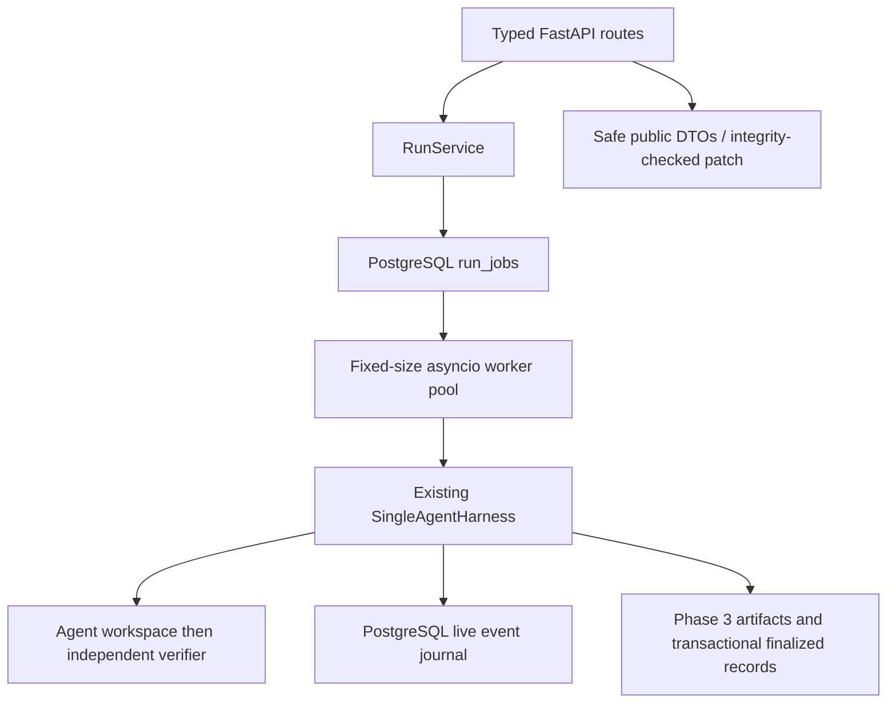

# Phase 4: FastAPI service and run management

This phase exposes the existing harness, official verifier, metrics, and
PostgreSQL repository. It does not implement a dashboard or another agent.

## Architecture and lifecycle



`POST /runs` validates the task, supported agent/strategy, and bounded resource
configuration, commits a queued job, and returns HTTP 202 with a `Location`
header. No benchmark execution happens inside the request handler. A lost HTTP
response after commit does not lose the queued job, but retrying POST creates a
new run: client idempotency keys are not implemented.

Workers claim queued rows using `FOR UPDATE SKIP LOCKED`, transition to
`running`, and invoke the harness. A small optional trace observer journals
events and transitions the ledger to `verifying`. The harness still owns tools,
limits, independent tests, cleanup, metrics, artifacts, and final persistence.
The API never treats an agent test run as official success.

The API reads finalized Phase 3 records preferentially. During execution it
reads the PostgreSQL job ledger and journal. Terminal trace events are published
only after final persistence because artifact/storage errors may change the
final outcome. Trace pagination is performed in SQL. Full raw finalized traces
remain unchanged; public events use a sanitized envelope.

No mutable run-state dictionary exists in production. The application stores
only shared dependencies, worker task references, and synchronization primitives.

### Concurrency, startup, and shutdown

`MAX_CONCURRENT_RUNS` is a fixed worker count, including verification and
finalization. With the default two workers, five submissions produce two active
runs and three queued runs. `MAX_PENDING_RUNS` bounds total queued plus active
jobs; excess submissions receive 503. PostgreSQL serializes admission checks.

A session advisory lock permits **one coordinator per database**. Use one
Uvicorn worker; do not use reload mode while running benchmarks. This is a small
local coordinator, not distributed scheduling. Claims are atomic and a run is
never automatically re-executed after being claimed.

Lifespan checks database/schema connectivity and catalog validity, acquires
ownership, reconciles interrupted jobs, then starts workers. It never runs
migrations or `create_all()`. Apply `0003_run_jobs` explicitly before startup.
The migration adds `run_jobs` and `run_job_events`; the immutable Phase 3 tables
and completion guard remain intact.

Queued jobs survive restart and resume. Interrupted active jobs without a
finalized record become `failed` with a terminal journal event. Jobs whose
finalized transaction committed before a crash reconcile to that result.
Database/ownership failures stop admission and further claims. An unavailable
database cannot receive a terminal update; restart after restoration performs
reconciliation. There is no automatic reconnect/retry execution loop.

Shutdown stops new claims, allows active work `SHUTDOWN_GRACE_SECONDS`, then
requests cooperative cancellation and awaits harness cleanup/finalization.
Interrupted execution uses the existing `failed` state. Queued jobs remain in
PostgreSQL. Hard kills or machine failure can leave Docker containers/temp
directories requiring operator cleanup; this phase has no orphan reaper.

Public cancellation is intentionally deferred. There is no fake cancel endpoint
or `cancelled` state. End-to-end cancellation semantics, including queued jobs
and races with verification/finalization, need a dedicated lifecycle change.

## Endpoints

All benchmark endpoints are under `/api/v1`.

| Method | Path | Response |
| --- | --- | --- |
| GET | `/health` | Process liveness, independent of database/Docker |
| GET | `/ready` | Database/schema and coordinator readiness; 503 if unavailable |
| GET | `/api/v1/tasks` | Metadata only |
| GET | `/api/v1/tasks/{task_id}` | Agent-visible configuration, never verification paths/tests |
| POST | `/api/v1/runs` | 202 queued ID and Location header |
| GET | `/api/v1/runs` | Paged summaries and filters |
| GET | `/api/v1/runs/{run_id}` | Status, verification summary, metrics, safe artifact metadata |
| GET | `/api/v1/runs/{run_id}/trace` | Ordered public events after a sequence number |
| GET | `/api/v1/runs/{run_id}/metrics` | Phase 3 aggregates, or null before available |
| GET | `/api/v1/runs/{run_id}/patch` | Hash-checked UTF-8 `text/x-diff` |
| GET | `/api/v1/runs/{run_id}/artifacts` | Type, size, SHA-256; no host paths |
| GET | `/docs`, `/openapi.json` | Interactive docs and typed OpenAPI 3.1 contract |

Run listing supports `limit` (1–100, default 20), `offset` (0–1,000,000), and
`task_id`, `agent`, `strategy`, `status`. Ordering is descending submission time
(execution start for legacy CLI records), then run ID. Trace supports
`after_sequence` (default 0) and `limit` (1–500, default 100). Use
`next_after_sequence` for subsequent polls; an empty page preserves the cursor.

An in-progress run has null `finished_at`, null verification/metrics, and no
artifacts until finalized. Inference measurements remain null even after a mock
run completes. Failures carry a safe reason and `failure_code`; raw exception
text stays outside public responses. Verification stdout/stderr and verifier
implementation names are excluded from public traces because failures can quote
hidden tests. The original audit trace remains in PostgreSQL/local artifacts.

The OpenAPI document includes response models, resource constraints, examples,
operation summaries, nullable metrics, error envelopes, and patch media type.
Public trace envelopes have typed common fields and a JSON-valued payload.

## Errors and safety

Errors use `{"error":{"code":"...","message":"..."}}`:

| HTTP | Codes |
| --- | --- |
| 404 | `task_not_found`, `run_not_found`, `artifact_not_found` |
| 409 | `artifact_integrity_failure` |
| 413 | `invalid_request` (oversized body) |
| 422 | `invalid_request`, `invalid_configuration`, `unsupported_agent`, `unsupported_strategy` |
| 503 | `service_unavailable` (dependency, coordinator, or admission capacity) |

Execution failures are persisted run resources, not delayed HTTP errors. Poll
their terminal status and `failure_code` (`run_execution_failure`,
`verification_failed`, or `run_timed_out`). Readiness has its own typed health
response rather than the error envelope. Startup fails safely if dependencies
or migrations are missing; liveness does not issue dependency checks once the
application is serving.

Request bodies are bounded before JSON parsing, including chunked bodies.
Unknown fields and invalid identifiers are rejected. Run configuration allows
only resource limits—not arbitrary commands, tools, model credentials, paths,
or mock scripts. Only `mock` and `single` are supported. Patch retrieval uses the
server-selected artifact record, checks the exact run-owned location, rejects
symlinks, bounds reads to 20 MB, and verifies size and SHA-256 before serving.
There is no raw artifact-file endpoint or generic shell endpoint.

Structured service logs contain event names, run IDs, outcomes, and safe error
classes, never request bodies, database URLs, or full exception reprs. These logs
are separate from benchmark traces. No observability stack is required.

No authentication is provided. Bind to loopback and trust local callers, the
catalog, and the artifact filesystem. Do not expose this execution service to
the internet. Reverse-proxy request/time limits and authentication are required
before any hosted deployment.

## Configuration and startup

Use Python 3.12, the runner Docker image, and migrated PostgreSQL. Export values
from an ignored `.env` based on `.env.example`; the application reads environment
variables, not an implicit cwd-dependent dotenv file.

| Variable | Default / purpose |
| --- | --- |
| `DATABASE_URL` | Required `postgresql+psycopg` URL; treated as a secret |
| `ARTIFACT_ROOT` | Repository `artifacts/` |
| `BENCHMARK_ROOT` | Repository `benchmarks/` |
| `MAX_CONCURRENT_RUNS` | 2; 1–16 |
| `MAX_PENDING_RUNS` | 100; total queued/active admission cap |
| `MAX_REQUEST_BYTES` | 16384 |
| `SHUTDOWN_GRACE_SECONDS` | 30; cooperative cleanup follows this grace period |
| `ENVIRONMENT` | development, test, or production |
| `RUNNER_IMAGE` | agentscope-runner:py312 |

```sh
source .venv/bin/activate
set -a
source .env
set +a
alembic -c backend/alembic.ini upgrade head
alembic -c backend/alembic.ini check
uvicorn app.main:create_app --factory --host 127.0.0.1 --port 8000 --workers 1
```

Host/port are Uvicorn options. Configure a server/process-manager termination
budget long enough for the grace period plus Docker cleanup. Readiness checks
PostgreSQL, not Docker; a Docker failure is a terminal execution failure.

## Actual HTTP demonstration

The following workflow was run against localhost port 8004 on September 17,
2026, using Docker and PostgreSQL, not a mock HTTP server:

```sh
curl -sS http://127.0.0.1:8004/ready
curl -sS http://127.0.0.1:8004/api/v1/tasks
curl -sS -i -X POST http://127.0.0.1:8004/api/v1/runs \
  -H 'Content-Type: application/json' \
  -d '{"task_id":"incorrect_api_response","agent":"mock","strategy":"single","configuration":{}}'
```

```text
HTTP/1.1 202 Accepted
location: /api/v1/runs/91ef7ab4ffa34d46b51207f1ac009373

{"run_id":"91ef7ab4ffa34d46b51207f1ac009373","status":"queued"}
```

```sh
RUN_ID=91ef7ab4ffa34d46b51207f1ac009373
curl -sS "http://127.0.0.1:8004/api/v1/runs/$RUN_ID"
curl -sS "http://127.0.0.1:8004/api/v1/runs/$RUN_ID/trace?after_sequence=24&limit=10"
curl -sS "http://127.0.0.1:8004/api/v1/runs/$RUN_ID/metrics"
curl -sS "http://127.0.0.1:8004/api/v1/runs/$RUN_ID/patch"
curl -sS 'http://127.0.0.1:8004/api/v1/runs?task_id=incorrect_api_response&agent=mock&strategy=single&status=completed&limit=1'
```

Observed result: `completed`, official tests **3/3**, six tool calls, three turns,
one modified file, +1/-1 lines, 230 patch bytes. Measured agent time was
383.867 ms; verification 460.685 ms; harness wall time 1241.823 ms. These are
smoke-test measurements, not comparative research. Inference fields were null.
Trace events 25–27 were `verification_started`, `verification_completed`, and
`run_completed`. Patch retrieval returned HTTP 200 and `text/x-diff`:

```diff
-    return {"state": "healthy"}
+    return {"status": "ok"}
```

The original fixture is unchanged. Full artifacts remain under
`artifacts/runs/91ef7ab4ffa34d46b51207f1ac009373/`. The demonstration server was
stopped gracefully afterward; PostgreSQL remains available for inspection.

## Validation and boundaries

Unit HTTP tests inject a test-only repository/runtime; production never uses
them. The real integration test submits five HTTP runs, observes the database
concurrency cap and live verification state, then retrieves final traces,
metrics, patches, and filtered listings. Other tests cover hidden-data
redaction, validation, OpenAPI, worker/storage failures, shutdown cleanup,
admission limits, restart reconciliation, and artifact tampering/path rejection.

```sh
pytest backend/tests
AGENTSCOPE_RUN_DOCKER_TESTS=1 TEST_DATABASE_URL="$DATABASE_URL" pytest backend/tests
ruff check backend
mypy --config-file backend/pyproject.toml backend/app
uv build backend
docker compose config --quiet
alembic -c backend/alembic.ini check
```

Explicitly deferred: React, provider adapters, additional benchmarks, Harbor,
multi-agent strategies, experiments/reports, WebSockets/SSE, Redis/Celery,
Kubernetes, authentication, distributed scheduling, and public cancellation.

The Phase 4 quality run passed **109 tests** with real Docker/PostgreSQL enabled.
Ruff and strict mypy passed (53 application modules), wheel/sdist builds passed,
Compose validated, and Alembic reported `0003_run_jobs (head)` with no schema
drift. No benchmark containers remained afterward.
