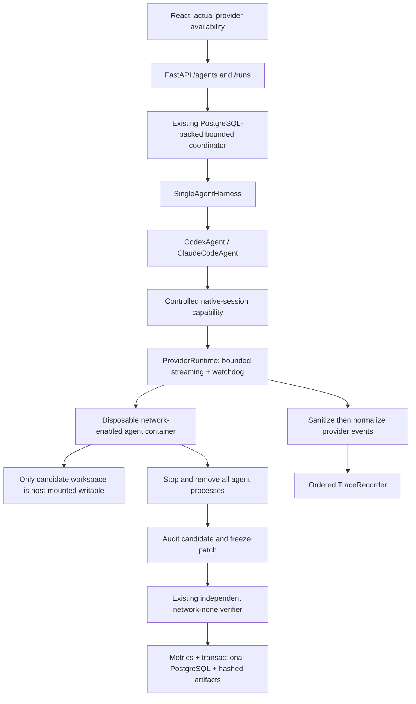

# Phase 6 — Real coding agents and provider telemetry

Phase 6 added Codex and Claude Code CLI adapters to the existing single-agent
harness. Its scope did not add multi-agent strategies or experiments. Both providers have been
demonstrated through the CLI and React dashboard with independent verification
and PostgreSQL persistence. Claude's login was renewed locally before its live
demonstration; credentials are not included in the recorded evidence.

Phase 7 has since added bounded staged and parallel strategies. This document
remains the Phase 6 provider-runtime contract; see [Phase 7](phase7.md) for the
current orchestration layer.

## Inspected interfaces and capability matrix

Host and Linux container versions were inspected with `--version`, `--help`,
`codex exec --help`, `codex exec resume --help`, `codex login --help`,
`codex features list`, and `claude auth --help` / `status --help`.

| Capability | Mock | Codex CLI 0.154.0 | Claude Code 2.1.220 |
|---|---|---|---|
| Real model | No | Yes, demonstrated | Yes, demonstrated |
| Non-interactive | Scripted turns | `exec` | `--print` |
| Structured events | Harness events | `--json` JSONL, recorded | `--output-format stream-json --verbose` |
| Tool events | Controlled registry | Command/file-change items | Assistant tool-use / user tool-result blocks |
| Usage | Not measured | Session-turn usage, observed | Result usage, observed and recorded |
| Per-request usage | No | Not relied on | Assistant usage supported; not aggregated as session totals |
| Session ID | Run ID only | Thread ID, observed | Session ID, observed during startup |
| Model selection | Not applicable | `--model`; default model not exposed in recorded stream | `--model`; startup reports model |
| CLI continuation | No | `exec resume` | `--resume` / `--continue` |
| Model-call count | Not measured | Unavailable in this adapter | Unavailable in this adapter |
| Model TTFT / ITL | Not measured | Unavailable | Unavailable |
| Generation throughput | Not measured | Unavailable | Unavailable |

Continuation is a CLI capability, **not** an enabled AgentScope workflow. Sessions
are ephemeral; no user configuration, skills, hooks, MCP integrations, or host
session history are imported. Codex native multi-agent features are explicitly
disabled. Claude's tool allowlist excludes delegation tools.

Installed help is authoritative for flags. Documentation cross-checks:
[Codex non-interactive mode](https://learn.chatgpt.com/docs/non-interactive-mode),
[Codex authentication](https://learn.chatgpt.com/docs/auth), and
[Claude programmatic execution](https://code.claude.com/docs/en/headless).
Newer online documentation can describe flags absent from these pinned versions;
those flags are not used.

## Architecture



`CodingAgent` remains the domain interface. The real adapters request one bounded
native CLI session through `ToolRegistry.run_provider`; they never receive a host
shell or workspace path. The trusted runtime receives the workspace from the
harness. A CLI session occupies **one harness turn**, not one model call.
Mock execution and independent verification retain their existing paths.

Key additions:

```text
backend/app/
  agents/external.py          CodexAgent and ClaudeCodeAgent
  providers/
    models.py                capabilities, metadata, options, safe failure codes
    security.py              explicit credential loading and redaction
    events.py                provider-native event normalization
    runtime.py               isolated streaming process lifecycle and budgets
  telemetry/provider_metrics.py
  api/routes/agents.py
docker/
  provider.Dockerfile         pinned Linux CLIs + Python 3.12/pytest
  provider_entry.py           stdin secret bootstrap, temporary isolated HOME
  disabled-auth.json          empty placeholder, never a credential
scripts/
  export_provider_auth.py     explicit local provisioning, outside repository
  export_provider_fixture.py  sanitized real-run fixture export
frontend/scripts/capture-provider-demo.mjs
backend/tests/
  test_providers.py           deterministic parsing/process replay tests
  test_provider_docker.py     actual Docker + verifier + PostgreSQL, no model calls
  test_provider_live.py       separately gated paid/live tests
  fixtures/providers/
```

## Isolation and network policy

The provider container has a read-only root filesystem, a non-root UID, all Linux
capabilities dropped, `no-new-privileges`, 2 CPUs, 2 GiB memory with no extra swap,
and a 256-PID limit. HOME is a 64 MiB tmpfs; `/tmp` is a 128 MiB tmpfs. There is
one writable host bind: the copied candidate. No Docker socket, baseline,
benchmark catalog, verifier tests, SSH directory, or PostgreSQL credentials are
passed. The image ID is recorded, and execution resolves the immutable image ID.

Provider containers use Docker's bridge network because they must contact the
model service. This is an explicit exception: setup/mock task containers and the
official verifier still use `--network none`. Bridge networking is **not** a
provider-domain egress allowlist and may reach other network-accessible services.
This remains a trusted, local-development harness, not a hostile multi-tenant
execution service. Outbound isolation/proxy policy is a future hardening item.

The API still controls the host Docker daemon via its socket; that is powerful
local-development authority, never delegated to agents. Sibling workspace mounts
must have the same absolute path in the API container and on the daemon host.

Limits:

- Overall timeout covers execution and verification. Cleanup runs on failures and cancellation.
- Observed native tool calls and conversational turns are bounded; exceeding a
  budget kills the container, including its child processes.
- Active observed tools have the configured command timeout. CLI events are
  observations, not pre-execution permission hooks; unreported internal model
  calls cannot be counted or individually budgeted.
- Candidate files are monitored every 100 ms and audited after all provider
  processes stop: configured per-file limit, 20 MB total, at most 4,096 files.
  A native CLI can briefly exceed an observed limit before termination. This is
  not the registry's atomic per-write contract. A process-wide `RLIMIT_FSIZE`
  broke Codex startup and is intentionally not used for CLI-private state.
- Combined stdout/stderr is capped by the run output budget (default 1 MB);
  native JSONL records are capped at 64 KiB and 2,000 retained observations.
  Oversize output terminates execution with an explicit truncation/limit event.
  Failure diagnostics retain at most 4 KiB of sanitized stderr, with truncation recorded.
- Known credential contamination, symlinks, special files, and hardlinks are
  rejected before a successful candidate is snapshotted or verified.

These limits are enforced by runtime code, not instructions asking the model to
behave. Prompts describe the task and request a minimal fix; they are not a
security boundary.

## Credential architecture

Credentials are loaded only from explicitly selected inputs:

- Codex: `CODEX_API_KEY` (or `OPENAI_API_KEY` mapped for the invocation), or
  `CODEX_AUTH_FILE` containing minimal ChatGPT CLI authentication.
- Claude: `ANTHROPIC_API_KEY`, `CLAUDE_CODE_OAUTH_TOKEN`, or `CLAUDE_AUTH_FILE`
  containing the selected `claudeAiOauth` bundle. Expired exported access tokens
  are not advertised ready; renew login and export a fresh bundle.

Credentials travel over the Docker attach stdin channel, not command arguments
or Docker container environment metadata. The container bootstrap writes only
the required auth file into temporary HOME or sets the allowlisted CLI variable,
then gives the agent `/dev/null` as stdin. No whole-home or keychain mount exists.
Credential values are absent from run configuration, PostgreSQL, and public
responses. Known values, bearer/JWT/key patterns, secret assignments, and secret
JSON keys are sanitized before trace retention. Raw authentication diagnostics
are withheld from the public trace endpoint.

Native coding tools can read their own process credentials or temporary HOME;
redaction is defense in depth, not a guarantee against deliberate encoding or
network exfiltration by hostile code. Use least-privilege/revocable credentials
and trusted benchmark sources. Official verification never receives credentials.

The optional provisioning script creates a **new mode-0600 file outside the
repository**, refuses overwrite, and prints only its path. On macOS it can read
the existing Claude Code credential bundle from that application's Keychain
entry. On Linux, explicitly supply the minimal CLI credential file or an API-key
environment variable. No authentication flow is performed implicitly.

## Events, telemetry, and storage

Normalized events include `provider_session_started`, `provider_message`,
`provider_tool_call_started`, `provider_tool_call_completed`, `provider_usage`,
`provider_session_completed`, `provider_process_failed`, and
`provider_output_truncated`. Native type/category and sanitized payload are
retained. Unknown event types remain auditable; malformed JSON/types fail safely.
There are no synthetic model-request boundary events.

`InferenceMetrics.provenance` labels every inference field as `measured`,
`derived`, or `unavailable`, with its source. Missing values stay JSON/SQL `null`.
Codex input includes cached input as a subset; Claude reports cache reads/writes
separately. Total tokens are derived without double-counting these categories.
Reasoning tokens are preserved only when reported, not estimated from messages.

**TTFT** requires an actual model request start and first generated token arrival.
**ITL** requires token-level arrival timestamps, not message chunks. Neither is
available here. Generation throughput requires actual generation boundaries;
dividing tokens by task wall time is not a substitute. The independently measured
`time_to_first_provider_output_ms` is process launch to first stdout bytes and
includes startup; it is not TTFT or time to first assistant token.

Provider tool counts deduplicate native tool IDs. Codex command/file-change items
map to `run_command`/`edit_file`; Claude Read/Edit/Write/Grep/Glob retain their
reliable meanings. Shell text is not guessed to be a test, file read, or git
operation. `agent_test_runs` still counts controlled `run_tests` events; the UI
labels these “Controlled-tool test runs.” Raw native commands remain inspectable.

Successful agent-phase duration now comes from a monotonic measured event field,
not UTC timestamp subtraction. This fixes clock-jump distortion discovered in an
early browser demo. Legacy traces without that field keep their historical
fallback. Old immutable database runs are not rewritten.

No schema migration is needed: provider provenance/configuration, inference
metrics/provenance, and raw events extend the existing JSONB documents. The
existing normalized run/event/verification/metric/artifact rows, uniqueness
constraints, transactions, and Alembic completion guard remain unchanged.
Provider name/version, image ID, selected/reported model, session ID, exit status,
duration, task version/source hash, and AgentScope commit (when available) persist.
This workspace has no `.git` directory, so its AgentScope commit is honestly null.

## Running locally

Start the existing database, migrate with Alembic, and build both runner images.
The ordinary `make dev` workflow still works with mock only.

```sh
make docker-image provider-image
python scripts/export_provider_auth.py --provider codex --output /tmp/agentscope-codex-auth.json
export CODEX_AUTH_FILE=/tmp/agentscope-codex-auth.json
# Export your migrated DATABASE_URL, then:
python -m app.cli run --task incorrect_api_response --agent codex --overall-timeout 120 --max-tool-calls 12
```

For the dashboard, optionally set `CODEX_AUTH_SOURCE` and/or `CLAUDE_AUTH_SOURCE`
to the owner-only files and use the override. Omitted providers receive only an
empty placeholder and are unavailable; credentials are not baked into images.

```sh
docker compose build backend frontend provider-image
docker compose -f docker-compose.yml -f docker-compose.providers.yml up -d --wait
curl localhost:8000/api/v1/agents
curl -X POST localhost:8000/api/v1/runs -H 'Content-Type: application/json' \
  -d '{"task_id":"incorrect_api_response","agent":"codex","strategy":"single","configuration":{"model":null}}'
```

`GET /agents` checks the Docker/executable version and configured auth readiness,
cached for 30 seconds. It does not make paid requests to validate remote credit,
permissions, or network availability; those failures become terminal run results.
Unavailable submissions return a typed `agent_unavailable` error. API options
remain bounded: a validated model identifier and existing resource limits, never
arbitrary CLI flags, commands, credential values, or paths.

## Real-run evidence

The final screenshot run is **`3b29ec6abf264b68bd3b2e398554aa91`**, launched
through the React dashboard against the actual Compose API and PostgreSQL.

| Observation | Actual value |
|---|---|
| Provider | `codex-cli 0.154.0` |
| Model | Not exposed; no model override was supplied |
| Official verdict | **3/3 passed** |
| Total / agent / verifier time | 22.496 s / 21.825 s / 0.463 s |
| Provider tools | 4: three commands and one edit; one command failed |
| Input / cached-input / output tokens | 50,541 / 47,616 / 288 |
| Total tokens | 50,829, derived |
| First provider output | 650.322 ms; **not TTFT** |
| Model calls / TTFT / ITL / generation throughput | Unavailable |
| Actual patch | One file, +1 / −2, 230 bytes |
| Persisted trace | 22 ordered events |

The extra removed line is a blank line; the patch is shown as produced, not
adjusted to match an expected screenshot. Provider assertions did not determine
the verdict. Browser evidence observed Queued → Running → Verifying → Completed,
incremental trace cursors, and no browser errors. PostgreSQL inspection confirmed
the run, trace, official result, and measured metrics in their respective tables.

- [New Run](images/phase6-codex-new-run.png)
- [Active provider trajectory](images/phase6-codex-active.png)
- [Completed independent verification](images/phase6-codex-completed.png)
- [Metrics and patch](images/phase6-codex-metrics-patch.png)
- [Machine-readable browser/run evidence](images/phase6-codex-evidence.json)

```sh
# Captures ONE real model-backed submission; opt in deliberately.
cd frontend
DEMO_URL=http://localhost:5173 DEMO_PROVIDER=codex node scripts/capture-provider-demo.mjs
```

The CLI run `phase6-codex-verified` also passed 3/3 (22.45 s, 60,677 input and
274 output tokens). Its sanitized native stream is the recorded regression fixture.
Earlier failed bootstrap attempts remain failed; they are not benchmark successes.
An earlier UI run `5c438954c48349f09047ee8c4131b99f` revealed UTC clock drift in
the old agent-duration calculation and is superseded by the monotonic-timed run above.

### Claude Code: renewed authentication and real dashboard run

Run `9643e9d77c3c4f30a8856ecd940eae6c` used Claude Code 2.1.220 and
`claude-sonnet-5`. Independent verification passed **3/3**. Total time was
8.227 s, agent time 7.528 s, and verification 0.461 s. Five provider tools
(two reads, two commands, one edit) succeeded; the patch was +1 / −1.

Provider usage reported 10 uncached input tokens, 64,569 cache-read tokens,
933 cache-creation tokens, and 510 output tokens: 66,022 total, derived from
disjoint categories. Claude's uncached input count is not directly comparable
to Codex's cache-inclusive input count. First provider output arrived at
334.048 ms; this is **not TTFT**. Model calls, TTFT, ITL, and generation
throughput remain null. These individual demonstrations are not a strategy or
provider performance comparison.

The browser observed all four lifecycle stages and incremental traces without
browser errors. Evidence and actual screenshots:

- [New Run](images/phase6-claude-code-new-run.png)
- [Active trajectory](images/phase6-claude-code-active.png)
- [Completed verification](images/phase6-claude-code-completed.png)
- [Metrics and patch](images/phase6-claude-code-metrics-patch.png)
- [Recorded browser/API evidence](images/phase6-claude-code-evidence.json)

The CLI run `phase6-claude-success` also passed 3/3 in 13.56 s. Earlier expired
authentication and candidate-audit failures remain failed, not rewritten as
successes. The audit false positive was fixed by matching credential values
only, not ordinary OAuth metadata such as subscription type, with a regression test.

## Testing and remaining boundaries

Final local gates: **140 backend tests passed**, with two paid live tests skipped
by default; **22 frontend tests passed**. Ruff, strict mypy (61 source files),
TypeScript, ESLint, generated OpenAPI contract check, frontend production build,
Python 0.6.0 wheel/sdist build, Compose validation, and Alembic schema check passed.
The backend suite included actual Docker/provider-isolation and PostgreSQL tests.
The separately demonstrated paid runs are recorded above, not silently enabled in CI.

Direct PostgreSQL inspection confirmed Codex's 22 and Claude's 34 trace events,
their verification and metrics rows, and three hashed artifacts each. A known-value
credential audit of 110 local artifact/evidence/fixture files found no credentials.
No containers carrying the run label remained after completion. These checks are
defense in depth, not a claim that unrestricted outbound networking prevents exfiltration.

```sh
pytest backend/tests
ruff check backend
mypy --config-file backend/pyproject.toml backend/app
AGENTSCOPE_RUN_DOCKER_TESTS=1 AGENTSCOPE_RUN_PROVIDER_DOCKER_TESTS=1 \
  TEST_DATABASE_URL=postgresql+psycopg://... pytest backend/tests
alembic -c backend/alembic.ini check
cd frontend
npm run check-api && npm run typecheck && npm run lint && npm test && npm run build
```

Recorded Codex and Claude events, constructed contract fixtures, malformed/missing
usage, safe errors, isolation flags, expired auth, output/turn/tool limits,
cleanup, null semantics, API availability, and provider UI selection are tested.
Offline Docker tests use an explicitly diagnostic process (not a fake model),
check the actual sandbox, independently pass/fail candidate code, and read it
back from PostgreSQL. Normal CI makes no paid calls.

`RUN_CODEX_LIVE_TESTS=1` or `RUN_CLAUDE_LIVE_TESTS=1` explicitly enables one tiny
live benchmark per selected provider, with 120-second/12-tool limits, migrated
`TEST_DATABASE_URL`, and configured auth. Both are skipped by default.

At Phase 6 completion, planner/reviewer and parallel agents were deferred; they
are now implemented by Phase 7. Harbor, benchmark expansion, repeated
experiments/comparisons, research reports, streaming transports, distributed
workers, authentication, hosted deployment, and egress proxying remain deferred.
Polling remains the dashboard transport.
