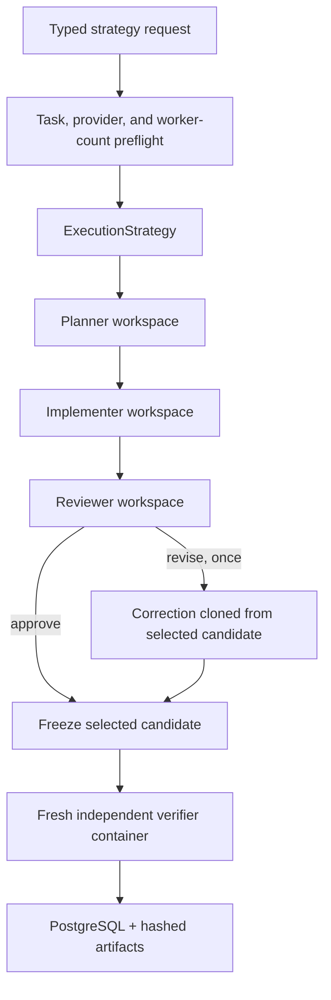
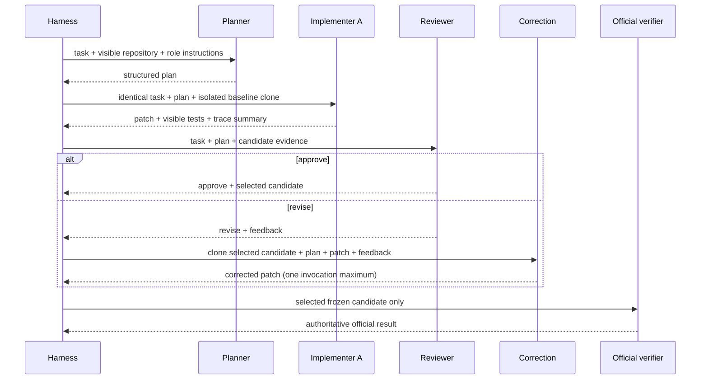
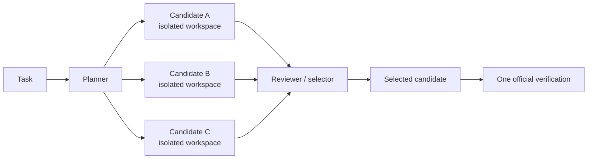

# Phase 7 — Planner/reviewer and parallel subagent architectures

Phase 7 adds bounded orchestration strategies over the Phase 1–6 execution,
provider, persistence, and independent-verification contracts. It implements
`single`, `planner_implementer_reviewer`, and `parallel_implementers`. It does
not add an experiment runner, repeated trials, statistical comparisons, Harbor,
or any other Phase 8+ feature.

> Individual Phase 7 demonstrations are functional validation of orchestration
> strategies, not statistically meaningful comparisons. Phase 9 will handle
> repeated controlled experiments.

## Architecture and verification boundary



The strategy layer is provider-neutral. `OrchestratedStrategy` owns decisions;
`StrategyAgent` owns isolated role invocation; provider adapters only execute one
requested role session. API routes validate and submit typed configuration but do
not contain orchestration logic. The original single-agent loop remains in
`SingleAgentStrategy` and is unchanged behind the execution boundary.

The authoritative order is always:

1. run role sessions and agent-visible tests;
2. have the reviewer select a candidate;
3. freeze and copy only that candidate into the parent workspace;
4. run official tests once in the existing independent verifier.

No unselected candidate receives official verification. A deterministic test
selects a deliberately bad candidate while another candidate would pass; the run
correctly ends `verification_failed`. This proves hidden outcomes cannot rescue or
rank candidates.

## Strategies

### Single

`single` preserves the Phase 6 path: one selected provider, one isolated
workspace, the existing turn loop, then independent verification. It has no
`StrategyResult` hierarchy because no sub-executions are introduced.

### Planner → implementer → reviewer



The planner returns `analysis`, nonempty `steps`, and optional
`files_likely_relevant`. The reviewer returns `approve` or `revise`, issues,
suggested changes, a selected candidate, and optional rationale. The parser scans
bounded output for the first schema-valid JSON object, so prose or Markdown fences
do not invalidate a good response. It never guesses a decision from prose.

A revision creates exactly one correction execution cloned from the selected
implementer's workspace. Phase 7 records whether correction occurred, changed the
patch, and changed a failing visible-test exit into success. The field
`correction_changed_official_result` remains `null`: determining that value would
require running hidden verification before correction, which would leak benchmark
ground truth into orchestration.

The deterministic correction fixture exercises the full path: the first
implementation is unchanged and fails visible tests, the reviewer requests
revision, one correction writes the valid response, visible tests improve, and
the corrected candidate alone passes 3/3 official tests.

### Parallel implementers



Two or three implementers receive identical task and plan text and independent
baseline clones. `asyncio` tasks start them concurrently. They cannot see sibling
workspaces. A failed candidate remains in the hierarchy and the reviewer sees the
remaining eligible candidates; all-candidate failure terminates the strategy.
The public count is a literal `2 | 3`, defaults to three, and is additionally
bounded by `MAX_PARALLEL_IMPLEMENTERS` (two or three).

## Role configuration and admission

Providers and optional validated model identifiers are configured independently
per role. Provider availability is probed before the job is admitted, so an
unavailable role cannot begin an expensive partial strategy. There is no implicit
fallback and no public surface for arbitrary CLI flags.

```json
{
  "task_id": "incorrect_api_response",
  "strategy": "planner_implementer_reviewer",
  "configuration": {
    "planner": {"agent": "claude-code"},
    "implementer": {"agent": "codex"},
    "reviewer": {"agent": "claude-code"}
  }
}
```

```json
{
  "task_id": "incorrect_api_response",
  "strategy": "parallel_implementers",
  "configuration": {
    "planner": {"agent": "claude-code"},
    "implementers": {"agent": "codex", "count": 3},
    "reviewer": {"agent": "claude-code"}
  }
}
```

All-Codex, all-Claude Code, mixed-provider, and mock configurations use the same
contract. `GET /api/v1/strategies` publishes names, roles, allowed worker counts,
and availability. `GET /api/v1/agents` remains the provider capability source.

## Workspace and credential isolation

Every role execution receives a new Docker workspace. Planner and reviewer
sessions may inspect only their own visible copy; implementations start from
independent baseline clones; correction starts from the selected implementation.
The only workspace later installed into the parent is the selected eligible
implementation or its correction.

Provider containers retain the Phase 6 constraints: non-root execution,
read-only root, dropped capabilities, `no-new-privileges`, CPU/memory/PID bounds,
temporary HOME, explicit credential transfer, and one writable candidate mount.
They receive no benchmark verification tree, sibling workspace, Docker socket,
database URL, or harness baseline. Official verification still runs separately
without provider credentials or network access. Cleanup covers success, role
failure, cancellation, and overall timeout; repository-copy cancellation waits
for the copy thread before removing its sandbox to avoid cleanup races.

## Hierarchical traces

Each sub-execution persists a stable `execution_id`, the parent run ID,
`role`, `provider`, and optional `candidate_id`. Scoped provider/tool events carry
the same fields. The root recorder assigns one locked, monotonic sequence across
concurrent children; timestamps and candidate IDs preserve observed interleaving.

```text
run 27e0…
├── planner / claude-code
├── implementer A / codex  ← selected
├── implementer B / codex
├── implementer C / codex
└── reviewer / claude-code
    └── candidate_selected A
        └── official verification (root event, once)
```

Strategy events include strategy, role, correction, parallel-group,
parallel-candidate, selection, and candidate-visible-test lifecycle events.
Concurrent completion order is not rewritten into alphabetical order.

## Metrics and null semantics

`StrategyMetrics` records strategy wall time, summed role time, provider
invocations and tools, per-role duration/tools/tokens, candidate and correction
counts, peak concurrent agents, summed provider-process time, the union of
provider-process intervals, peak concurrent provider processes, and the derived
concurrency factor:

```text
concurrency_factor = summed provider process time / strategy wall time
```

This is an agent-execution concurrency metric, not GPU utilization, GPU duty
cycle, or model-serving utilization. Values are derived only when every relevant
provider process supplies complete monotonic duration and timestamp metadata.
Missing provider usage stays `null`; mixed known/unknown token totals do not become
partial sums. Claude cache categories and Codex input semantics remain distinct,
so input counts are not assumed directly comparable.

`estimated_cost` is `null`. No pricing table was configured, and Phase 7 does not
hard-code changing provider prices into domain logic.

## PostgreSQL model

Alembic revision `0004_strategy_executions` adds:

- `sub_executions`: queryable run/parent IDs, role, provider, provider version,
  candidate, selected flag, status, and duration, plus the typed full payload;
- `strategy_results`: selected candidate, reviewer decision, correction count,
  candidate count, peak concurrency, and strategy metrics.

The parent `runs` row retains strategy and bounded configuration. Role/provider,
candidate, selection, and hierarchy dimensions are normal columns rather than an
opaque strategy blob. Events, verification, metrics, and artifacts retain their
existing transactional guarantees; a child insertion failure rolls back the
whole finalized run.

## Dashboard representation

New Run discovers strategies and providers, renders only relevant role controls,
disables unavailable providers, and offers only server-reported worker counts.
Run Detail groups scoped traces by planner, candidate, reviewer, and correction;
each candidate exposes its own trace, visible-test result, changed files, patch,
and `+added / −removed` size. The selected candidate and reviewer rationale are
explicit. Unselected candidates have no official-verification field because they
were never verified.

- [Mixed-role New Run](images/phase7-planner_implementer_reviewer-new.png)
- [Mixed-role live hierarchy](images/phase7-planner_implementer_reviewer-active.png)
- [Mixed-role completed metrics, selected patch, and verification](images/phase7-planner_implementer_reviewer-completed.png)
- [Parallel New Run](images/phase7-parallel_implementers-new.png)
- [Three concurrent candidate traces](images/phase7-parallel_implementers-active.png)
- [Parallel candidate hierarchy, strategy metrics, selected patch, and verification](images/phase7-parallel_implementers-completed.png)

## Real architecture demonstrations

These were one-off, opt-in browser submissions on `incorrect_api_response`, not
repeated trials. All used the actual Compose API, Docker provider runtime,
PostgreSQL, dashboard polling, and independent verifier. Browser evidence
recorded no page errors.

| Strategy / run | Actual roles | Official result | Total wall | Tokens (input / output / total) | Tools | Candidates / corrections | Peak provider processes | Derived concurrency |
|---|---|---:|---:|---:|---:|---:|---:|---:|
| `single` / `cc8f36…` | Codex | 3/3 passed | 21.937 s | 50,867 / 276 / 51,143 | 4 | 1 / 0 | 1 | N/A |
| `planner_implementer_reviewer` / `7baf888…` | Claude → Codex → Claude | 3/3 passed | 37.395 s | 38,639 / 1,532 / 120,681 | 10 | 1 / 0 | 1 | 0.972 |
| `parallel_implementers` / `27e0faa…` | Claude → 3× Codex → Claude | 3/3 passed | 43.392 s | 142,605 / 2,097 / 227,069 | 18 | 3 / 0 | 3 | 1.955 |

The staged strategy measured 36.683 s strategy wall time, 35.655 s summed
provider time, and 35.656 s provider interval-union time. Its role totals were:
planner 6.898 s / 39,450 tokens / 3 tools; implementer 18.047 s / 38,930
tokens / 4 tools; reviewer 11.731 s / 42,301 tokens / 3 tools.

The parallel strategy measured 42.670 s strategy wall time, 83.441 s summed
provider time, and 41.382 s provider interval-union time. The three implementers
overlapped, peaked at three provider processes, and together used 143,512 tokens
and 12 tools over 68.474 summed execution seconds. The Claude planner used 39,462
tokens / 3 tools; the Claude reviewer used 44,095 tokens / 3 tools. All three
Codex candidates produced the same one-line functional patch; the reviewer chose
candidate A before the single official verification.

Token categories follow provider-native semantics. In particular, Claude totals
include cache-read and cache-creation categories while its displayed uncached
input can be small. These rows therefore validate instrumentation and topology;
they are not provider or strategy performance rankings.

Machine-readable evidence:

- [single](images/phase7-single-evidence.json)
- [planner/implementer/reviewer](images/phase7-planner_implementer_reviewer-evidence.json)
- [parallel implementers](images/phase7-parallel_implementers-evidence.json)

The capture script is explicitly paid/opt-in:

```sh
cd frontend
RUN_PHASE7_LIVE=1 DEMO_STRATEGY=parallel_implementers \
  node scripts/capture-strategy-demo.mjs
```

## Deterministic failure semantics

| Failure | Result |
|---|---|
| Planner fails, times out, or has no valid plan JSON | Strategy fails; no implementer or verifier |
| Staged implementer fails | Strategy fails; no reviewer or verifier |
| One parallel candidate fails | Continue with eligible candidates; failed child remains recorded |
| Every parallel candidate fails | Strategy fails; no reviewer or verifier |
| Reviewer fails, times out, or selects an ineligible candidate | Strategy fails closed; no verifier |
| Reviewer output has surrounding prose but valid JSON | Parse the valid bounded JSON object |
| Reviewer output has no valid decision | Strategy fails closed; no guessed approval |
| Correction fails or times out | Strategy fails; no fallback to pre-correction patch |
| Provider unavailable at submission | Reject before queueing |
| Enclosing timeout | Cancel roles, stop containers, retain timed-out hierarchy, clean workspaces |

## Quality gates

Phase 7 adds deterministic coverage for structured parsing, approval and
correction, the one-correction cap, two/three-way true overlap, candidate
isolation and failures, selected-only verification, scoped events, null telemetry,
metric aggregation, queryable PostgreSQL hierarchy, API preflight, dynamic UI,
candidate traces, and candidate patches.

The ordinary local gate is 151 backend tests passed (10 opt-in tests skipped by
default) and 23 frontend tests passed. With real Docker, offline provider
isolation, and PostgreSQL enabled, 159 backend tests passed and only the two paid
live tests were skipped. Ruff, strict mypy, OpenAPI generation drift, TypeScript,
ESLint, the production Vite build, Alembic schema check, Compose validation, and
the Python 0.7.0 wheel/sdist build pass. Paid provider tests remain explicitly
opt-in and are represented by the recorded demonstrations above.

## Explicitly deferred

Phase 7 does not implement Harbor, benchmark-suite expansion, an experiment
runner, repeated trials, statistical comparisons, research charts, a final
research report, cloud deployment, distributed orchestration, or Kubernetes.
Those remain later-phase work and require separate approval.
