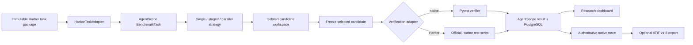
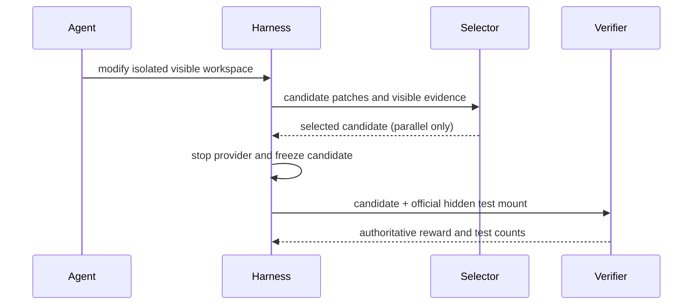

# Phase 8 — Harbor interoperability and AgentScope Benchmark v0.1

Phase 8 adds a narrow Harbor task/verification adapter and freezes a diverse,
reproducible native benchmark. Harbor does not run AgentScope strategies and does
not replace AgentScope traces, telemetry, persistence, candidate selection, or UI.
Repeated trials, statistical analysis, rankings, and research conclusions remain
Phase 9 work.

> Individual Phase 8 demonstrations are functional validation of task
> interoperability and benchmark execution, not statistically meaningful
> comparisons. Phase 9 will handle repeated controlled experiments.

## Current Harbor interface inspected

The integration was developed against the installed/current `harbor` CLI, version
**0.23.0**, on 2026-09-18. The inspection used `harbor --help`, `harbor task
schema`, `harbor trial schema`, `harbor job schema`, `harbor agent list`, and
`harbor agent schema codex|claude-code`. In this release the dataset command is
singular (`harbor dataset list`) and directs users to Harbor Hub; there is no
`harbor datasets list` command.

- Task packages use `instruction.md`, `task.toml`, `environment/`, `solution/`,
  and `tests/`. Harbor 0.23.0 defaults new tasks to schema 1.4; the adapter accepts
  current 1.0–1.4 packages and rejects unknown schema versions.
- The CLI advertised 44 agent adapters, including `codex`, `claude-code`, Aider,
  Gemini CLI, OpenHands, mini-SWE-agent, SWE-agent, and `nop`. AgentScope exposes
  only its independently supported Codex and Claude Code providers; discovering a
  Harbor adapter does not make it an AgentScope provider.
- Harbor Hub is the current dataset registry. The Phase 8 smoke subset comes from
  `terminal-bench/terminal-bench-2-1`, dataset version `2.1@6`.
- A Harbor job contains per-trial `agent/`, `verifier/`, `artifacts/`,
  `config.json`, `lock.json`, `results.json`, and `trial.log` material.
- Agent trajectories use ATIF. The inspected Harbor version emits ATIF v1.8 and
  supports nested subagent trajectories.
- Official verification runs the package verifier against the frozen candidate.
  Tests are mounted at `/tests`, the optional reference at `/solution`, and the
  verifier writes `/logs/verifier/reward.txt` or `reward.json`. Separate and
  shared verifier modes and verifier network policies exist in Harbor.

These observations—not an assumed SDK—define the adapter contract. Harbor remains
an optional import-time/source-format dependency; normal AgentScope execution does
not import Harbor Python internals.

## Integration boundary



AgentScope owns provider invocations, role hierarchy, concurrent isolated
workspaces, reviewer selection, candidate freezing, metrics, persistence, and
the dashboard. Harbor compatibility supplies task environment and official
verification semantics only. Imported tasks therefore work unchanged with
`single`, `planner_implementer_reviewer`, and `parallel_implementers`; execution is
never delegated to Harbor.

The optional Harbor-native agent baseline was not added. Doing it faithfully
would require handing execution ownership and provider telemetry to Harbor, so it
is documented as a possible later compatibility study rather than being made a
Phase 8 dependency.

## Task mapping and provenance

`HarborTaskAdapter` maps a package as follows:

| Harbor material | AgentScope representation |
| --- | --- |
| `instruction.md` | task description, with the Harbor workdir mapped to `/workspace` |
| `[task]` / `[metadata]` | stable ID, title, tags, language, difficulty, original metadata |
| `environment/` | agent-visible seed files plus declared image/workdir/network policy |
| `tests/` | hidden `harbor` verification specification |
| `[agent].timeout_sec` | bounded task timeout |
| `[verifier].timeout_sec` | independent verifier timeout |
| source package | immutable copy under `benchmarks/harbor/` |

The source package is never mutated. Each task records source, dataset, dataset
version, original task ID/version, import time, Harbor/schema versions, task,
environment, and verifier SHA-256 hashes, plus the AgentScope commit when a Git
checkout supplies one. This delivered workspace has no `.git` metadata, so that
field is honestly `null`; the immutable content hashes remain available.

Migration `0005_benchmark_provenance` adds queryable `task_source`,
`task_dataset`, `dataset_version`, and `task_hash` run columns. Provider-specific
details stay in JSON, while experiment dimensions do not.

The catalog validates every frozen hash when tasks load. Editing task,
environment, or verifier content without explicitly refreezing the manifest makes
the catalog fail closed.

## Verification and isolation



Only files below Harbor `environment/` are copied into the agent workspace, and
the environment Dockerfile itself is excluded. `solution/`, `tests/`, reference
patches, canaries, verifier outputs, database credentials, and sibling candidate
workspaces never enter agent context. The official Harbor verifier receives the
frozen selected workspace, read-only `/tests`, and a dedicated logs mount. Only
the selected parallel candidate is verified.

The verifier adapter treats a reward of `1` as success and parses CTRF output for
test counts when available. Missing rewards, non-unit rewards, timeout, malformed
result files, or test failures cannot become a pass. Some official Harbor scripts
install their own verifier dependencies as root; that verifier container keeps
CPU/memory/PID limits and `no-new-privileges`, but does not drop all capabilities.
Provider containers retain the stricter capability drop. This exception does not
grant access to provider credentials, PostgreSQL, hidden host paths, or Docker.

## Trajectory compatibility

The AgentScope trace remains authoritative because it includes deterministic
sequence numbers, execution IDs, parent IDs, roles, candidates, provider-native
payloads, and concurrent interleaving. `runs export-atif` writes ATIF v1.8 while
embedding every native event losslessly in
`step.extra.agentscope_event`; child executions become ATIF subagent
trajectories. The importer only promotes such AgentScope envelopes back to a
native trace.

Generic ATIF can be consumed by Harbor tooling, but cannot be losslessly promoted
to an AgentScope trace: ATIF does not necessarily carry AgentScope's exact global
sequence, candidate-selection, verifier-boundary, or metric-provenance semantics.

```bash
python -m app.cli runs export-atif RUN_ID --output trajectory.json
```

## AgentScope Benchmark v0.1

The frozen suite contains 12 small, multi-file software-maintenance repositories:

| Task | Language | Difficulty | Behavior |
| --- | --- | --- | --- |
| `incorrect_api_response` | Python | easy | API response correctness |
| `request_validation` | Python | easy | boundary validation |
| `cursor_pagination` | Python | medium | stable cursor pagination |
| `transaction_transition` | Python | medium | transactional state transition |
| `cache_invalidation` | Python | medium | multi-tenant cache invalidation |
| `bounded_retry` | Python | medium | bounded retry/timeout behavior |
| `resource_cleanup` | Python | medium | resource lifecycle on early exit |
| `extract_transport_refactor` | Python | medium | behavior-preserving abstraction |
| `js_ttl_cache` | TypeScript/JavaScript | medium | expiry and time semantics |
| `lock_inventory` | Python | hard | locking and shared state |
| `cross_file_permissions` | Python | hard | authorization across modules |
| `js_batch_dedupe` | TypeScript/JavaScript | hard | concurrent batching/deduplication |

Distribution: 10 Python and 2 TypeScript/JavaScript tasks; 2 easy, 7 medium,
and 3 hard. Difficulty describes expected exploration, state/concurrency
reasoning, ambiguity, and hidden edges—not merely patch size, and is not a
scientific claim.

The exact task versions and hashes are frozen in
[`benchmarks/manifest.json`](../benchmarks/manifest.json). References live outside
agent repositories under `benchmarks/reference/`; official tests live under
`benchmarks/verification/`. A content change must advance its task version/hash
and explicitly regenerate the manifest. Phase 9 can therefore select a stable
AgentScope Benchmark v0.1 rather than a mutable directory.

## Validation gate and broken-task detection

```bash
python -m app.cli benchmark validate
python -m app.cli benchmark validate --include-external --task TASK_ID
python -m app.cli benchmark freeze
```

For every native task the validation gate builds/materializes the environment,
checks frozen hashes and metadata, proves the unchanged baseline fails, installs
the hidden reference solution, proves it passes twice, compares repeated verifier
outcomes for determinism, and scans the agent-visible tree for hidden material.
It reports baseline-pass, reference-fail, nondeterminism, build/runtime failure,
timeout, missing metadata, stale hashes, and isolation violations as explicit
errors. A broken task cannot silently validate.

All 12 v0.1 tasks passed this gate in Docker: 12/12 baselines failed, 12/12
references passed twice, all repeated results matched, and all isolation checks
passed. Network is disabled for native task execution and verification.

## External interoperability smoke test

Four immutable tasks were imported from the official Terminal-Bench 2.1 source
at upstream commit `7131e4375048a0e408a8fb404b5f499d726b695b`:

- `cancel-async-tasks` (Python/concurrency)
- `break-filter-js-from-html` (JavaScript/security)
- `query-optimize` (SQL/query planning)
- `custom-memory-heap-crash` (C++/memory management)

All four parse and pass catalog/isolation smoke checks. The official
`cancel-async-tasks` verifier was exercised more deeply: its unchanged baseline
failed, its official reference passed twice with identical results, and a real
AgentScope single-Codex execution reached the official verifier, PostgreSQL, and
dashboard. The candidate earned 5/6 tests and therefore correctly finished
`verification_failed`; interoperability is demonstrated without rewriting the
official outcome.

## Real architecture demonstrations

These are one-off functional demonstrations on 2026-09-18, not comparisons:

| Run | Task / strategy | Roles | Official result | Wall time | Tokens | Tools |
| --- | --- | --- | --- | ---: | ---: | ---: |
| `phase8-native-easy-v2` | request validation / single | Codex | 5/5 pass | 47.42 s | 75,081 | 5 |
| `phase8-native-medium-staged` | cache invalidation / staged | Codex → Codex → Codex | 2/2 pass | 104.96 s | 160,859 | 10 |
| `phase8-native-hard-parallel-v2` | cross-file permissions / parallel 2 | Codex planner → 2 Codex implementers → Codex reviewer | 1/1 pass | 101.54 s | 236,807 | 15 |
| `phase8-harbor-cancel-async` | Terminal-Bench / single | Codex | 5/6, verification failed | 99.29 s | 66,903 | 4 |

Token totals are provider-reported measured/derived telemetry with provenance;
they are not estimates of model-internal work. The parallel run selected one
candidate before verification and invoked the official verifier once. Claude Code
was unavailable in this environment because no explicit Claude credential source
was configured, so the Phase 8 live demonstrations used Codex. Mixed-role
Codex/Claude behavior remains covered by Phase 7 and adapter tests.

## API and dashboard

`GET /api/v1/tasks` and task details expose only public catalog fields:
language, difficulty, source, dataset, dataset version, tags, and task hash.
Filters accept source, dataset, language, difficulty, and tag. The New Run browser
shows those fields and continues to expose all three AgentScope strategies. It
does not serialize verification paths, reference locations, solution content, or
official test content.

## Limitations and deferred work

- Import currently targets local current-schema Harbor task packages; automatic
  Hub download/resolution is intentionally outside the execution path.
- Dockerfile-based Harbor environments are preserved and hashed, but Phase 8's
  direct adapter uses declared/prebuilt images rather than cloning Harbor's image
  builder. Unsupported environment features fail instead of being guessed.
- Verifier network policy is preserved as metadata; the smoke task's official
  script required public dependency installation. Native tasks remain offline.
- Generic ATIF import is intentionally non-authoritative and lossy fields are
  documented above.
- The Harbor-native agent baseline is deferred rather than duplicating Harbor.
- This phase adds no repeated trials, experiment matrix, statistical analysis,
  provider/strategy ranking, confidence intervals, cost frontier, research chart,
  leaderboard, cloud runner, or final report. Those belong to Phases 9–10 and
  require separate approval.
