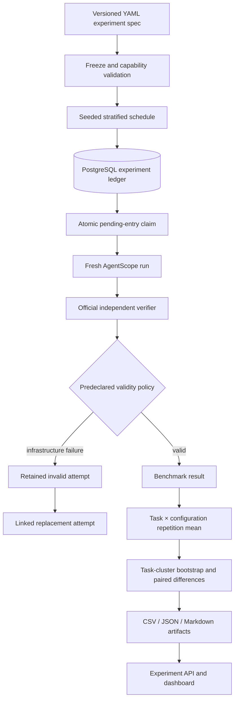

# Phase 9 — Controlled repeated experiments and statistical analysis

> Phase 9 records the frozen experiment and technical analysis. The completed
> publication synthesis and offline figures are in the
> [Phase 10 research report](research-report.md); Phase 9 measurements were not
> rerun or rewritten for that release.

Phase 9 adds an immutable experiment layer above the existing run harness. Its
purpose is to measure strategy trade-offs under controlled inputs—not to rank
providers or declare a universally best architecture. Phase 10 presentation,
leaderboards, marketing claims, and polished research charts remain deferred.

## Research questions and controlled inputs

The primary question is: **How does coding-agent orchestration strategy affect
correctness and inference workload when provider, benchmark, and environment are
held constant?** The frozen primary study uses Codex in every role and compares:

1. `single-codex`
2. `staged-codex`: Codex planner → Codex implementer → Codex reviewer
3. `parallel2-codex`: Codex planner → two isolated concurrent Codex implementers
   → Codex reviewer/selector

All 12 AgentScope Benchmark v0.1 tasks run three times per configuration, for 108
scheduled repetitions. Every repetition starts with a new workspace and provider
process/session. Cross-run concurrency is one; concurrency inside
`parallel2-codex` is the experimental treatment.

The immutable benchmark manifest SHA-256 is
`132a2070b12f143d889a2b88af200063800194162835bbdd3eea01aef8f38f80`.
Each task hash, provider version, AgentScope version, strategy implementation
hash, runtime image ID, specification hash, exact schedule, and timestamp is
persisted with the experiment. This workspace contains no `.git` metadata, so
`agentscope_commit` remains honestly `null` and content/configuration hashes carry
the reproducibility boundary.

## Architecture



`experiments`, `experiment_configs`, `experiment_schedule`, and
`experiment_runs` are queryable tables introduced by Alembic migration
`0006_controlled_experiments`. Schedule entries reference the existing immutable
run records instead of duplicating their traces. Stable task, configuration,
repetition, order, run, and replacement IDs make interruption and audit possible.
An experiment ID cannot be reused with a different specification hash. Migration
`0007_protocol_exclusions` distinguishes infrastructure-invalid attempts from
already-executed replacements excluded by a deterministic protocol audit.

## Specifications and schedule

Machine-readable definitions live under `experiments/phase9/`:

- `strategy-study-pilot-v1.yaml`: two tasks × three strategies × one repetition.
- `strategy-study-v1.yaml`: the 108-run primary controlled study.
- `provider-study-v1.yaml`: a separate 72-run single Codex versus single Claude
  Code study, executable only when both providers are explicitly available.

The primary spec SHA-256 is
`bd84864140363cb6431f73118cf20f18f7ca6d4dbeccad3e05e310e1d826bf56`.
Its schedule seed is `20260918`; its task-bootstrap seed is `20260919`. The
planner stratifies by repetition and task, then reproducibly shuffles
configuration order instead of executing treatment blocks. The persisted
schedule—not a regenerated in-memory order—is authoritative after initialization.

```bash
python -m app.cli experiments validate experiments/phase9/strategy-study-v1.yaml
python -m app.cli experiments plan experiments/phase9/strategy-study-v1.yaml
python -m app.cli experiments run experiments/phase9/strategy-study-v1.yaml
python -m app.cli experiments status strategy-study-v1
python -m app.cli experiments audit strategy-study-v1
python -m app.cli experiments summarize strategy-study-v1
```

`plan` reports task/configuration/repetition counts, provider requirements,
estimated provider invocations, maximum treatment concurrency, and configured
cost when explicit pricing exists. Absence of a price does not block execution.

## Independence, resumability, and budgets

The runner atomically claims one entry at a time and uses deterministic run IDs.
Completed valid entries are never claimed again. A process restart recovers an
orphaned running entry, records the interrupted attempt, and links a replacement.
The live primary study was deliberately stopped after one entry and resumed at
entry two, demonstrating that the stored schedule prevents duplicate repetitions.

Optional limits cover total valid runs, provider invocations, measurable tokens,
and derived estimated cost when pricing is configured. Reaching a limit pauses
the experiment without discarding state. Provider rate-limit/infrastructure
retries use bounded backoff and remain attempts within the same scheduled
repetition; they do not create additional independent chances to solve the task.

## Validity policy fixed before execution

Official independent verification is the primary binary outcome. A verifier
failure is data and is never retried merely to obtain success. The following
classification was defined before the full matrix ran:

| Event | Classification |
| --- | --- |
| Official verifier does not pass | valid benchmark failure |
| Agent reaches configured task timeout | valid benchmark failure |
| Agent/provider process fails within an otherwise healthy execution | valid benchmark failure |
| Malformed role output cannot be recovered | valid benchmark failure |
| Global provider outage/authentication expiry/rate-limit interruption | infrastructure failure |
| Docker daemon, database, or AgentScope runner failure | infrastructure failure |

Infrastructure attempts are retained and linked to controlled replacements.
They are excluded from benchmark aggregates. Classification is not changed after
examining which treatment would benefit.

## Statistical unit and analysis

The 108 runs are **not** 108 independent task observations. Repetitions share a
benchmark task and are clustered. Analysis first computes the mean of the three
repetitions for every task × configuration cell, then treats the 12 task-level
values as the cross-task inputs.

Mean task success probability receives a reproducible 95% nonparametric bootstrap
interval by resampling tasks, not runs, with replacement. Every paired comparison
uses within-task differences and reports mean difference, median difference, and
a task-bootstrap 95% interval. Latency, token, and tool summaries use task-level
repetition averages and report mean, median, p25, and p75; no fragile p95 is
reported from 12 values.

Resource summaries include all valid runs. Successful-run-only summaries are
separately labeled to avoid hiding failure rates. `tokens_per_success`,
`wall_time_per_success`, and `provider_invocations_per_success` are undefined
when a group has zero successes rather than reported as infinity.

`task wall time`, `strategy wall time`, `provider process duration`, and
`time_to_first_provider_output` retain their exact meanings. TTFT, ITL, and
generation throughput remain null unless directly measured. The derived
`concurrency_factor = summed provider execution time / strategy wall time`
measures execution overlap; it is not GPU, compute, or inference utilization.

## Pilot

The six-run pilot covered `incorrect_api_response` and `cache_invalidation` once
under each treatment. It completed 6/6 valid runs, all with official success and
complete token telemetry, and had no infrastructure exclusions. It validated
authentication, fresh sessions, isolation, persistence, statistical export, and
budgets. A raw-export-only duplicate session-ID field was detected for multi-role
runs and corrected before the primary matrix; the underlying provider sessions
and invocation metrics were already unique and no treatment behavior changed.

The pilot's one-off timings and token counts are retained under
`results/strategy-study-pilot-v1/`, but are not used as comparative evidence and
did not change the primary method.

## Primary observed results

The full primary matrix ran from 2026-09-18T23:06:44Z through
2026-09-19T14:23:13Z. It produced 108/108 valid scheduled results: 51 official
successes and 57 benchmark failures. One attempt was excluded for a PostgreSQL
`DataError` and replaced. Two initial agent timeouts were initially retried due to
an overly broad cancellation classification; a deterministic audit restored the
original timeouts as benchmark failures and marked their already-executed
replacements `protocol_excluded`. Both replacements also timed out, so the audit
did not change correctness counts. Every attempt remains persisted and linked.

| Configuration | Successes | Mean task success | Task-bootstrap 95% CI | Median task wall | Median tokens | Median provider tools |
| --- | ---: | ---: | --- | ---: | ---: | ---: |
| single Codex | 21/36 | 58.33% | 33.33%–83.33% | 49.67 s | 83,121 | 5.67 |
| staged Codex | 15/36 | 41.67% | 19.44%–63.89% | 108.13 s | 156,589 | 9.50 |
| parallel-2 Codex | 15/36 | 41.67% | 19.44%–63.89% | 106.83 s | 230,514 | 14.67 |

Task-cell outcomes are official successes over three repetitions:

| Task | Single | Staged | Parallel-2 |
| --- | ---: | ---: | ---: |
| `bounded_retry` | 3/3 | 2/3 | 2/3 |
| `cache_invalidation` | 3/3 | 3/3 | 2/3 |
| `cross_file_permissions` | 3/3 | 3/3 | 3/3 |
| `cursor_pagination` | 0/3 | 0/3 | 0/3 |
| `extract_transport_refactor` | 0/3 | 0/3 | 0/3 |
| `incorrect_api_response` | 3/3 | 3/3 | 3/3 |
| `js_batch_dedupe` | 3/3 | 1/3 | 1/3 |
| `js_ttl_cache` | 0/3 | 0/3 | 0/3 |
| `lock_inventory` | 0/3 | 0/3 | 0/3 |
| `request_validation` | 3/3 | 1/3 | 2/3 |
| `resource_cleanup` | 3/3 | 2/3 | 2/3 |
| `transaction_transition` | 0/3 | 0/3 | 0/3 |

Paired task differences (left minus right) were:

| Pair | Outcome | Mean difference | Median difference | Task-bootstrap 95% CI |
| --- | --- | ---: | ---: | --- |
| single − staged | success probability | +0.1667 | 0 | +0.0278 to +0.3333 |
| parallel − single | success probability | −0.1667 | 0 | −0.3056 to −0.0556 |
| parallel − staged | success probability | ~0 | 0 | −0.0833 to +0.0833 |
| single − staged | task wall time | −52.91 s | −56.51 s | −61.00 to −43.80 s |
| parallel − single | task wall time | +56.31 s | +59.15 s | +42.78 to +71.51 s |
| parallel − staged | task wall time | +3.40 s | +0.66 s | −7.41 to +16.81 s |
| single − staged | total tokens | −69,416 | −73,183 | −82,541 to −54,974 |
| parallel − single | total tokens | +146,001 | +148,432 | +129,949 to +164,703 |
| parallel − staged | total tokens | +71,320 | +67,434 | +59,022 to +84,321 |

Token differences involving parallel used 11 paired tasks because one parallel
task had no complete provider token telemetry; all success, wall-time, and tool
comparisons used 12 tasks. These descriptive intervals characterize this small
benchmark and do not establish a universal or provider-level ranking.

Workload accounting kept wall and summed process time separate:

| Configuration | Median strategy wall | Median summed provider time | Provider invocations | Tool calls | Median peak processes | Median concurrency factor |
| --- | ---: | ---: | ---: | ---: | ---: | ---: |
| single Codex | 48.94 s | 48.82 s | 36 | 206 | 1 | unavailable |
| staged Codex | 107.61 s | 106.21 s | 100 | 325 | 1 | 0.984 |
| parallel-2 Codex | 106.26 s | 146.43 s | 135 | 499 | 2 | 1.324 |

Single-agent tokens were complete at 3,025,473. Staged telemetry measured
3,816,720 tokens for 25/36 runs and parallel telemetry measured 5,970,173 for
26/36; exact strategy totals remain `null` because missing provider measurements
were not fabricated. The single/staged/parallel summed provider process totals
were 1,811.56 s, 3,668.41 s, and 5,210.31 s respectively. The derived parallel
concurrency factor describes process overlap only.

Positive paired differences in exported files mean the left-named configuration
has the larger metric. Intervals are descriptive uncertainty summaries over this
12-task benchmark; the implementation does not turn them into significance
labels or an overall winner.

## Correction and parallel-candidate integrity

One of 36 staged runs requested correction (2.78%). That correction did not
change the patch, did not improve visible tests, and did not produce an official
success. This is a single observed event, not evidence about correction utility.

Across 36 parallel runs, the mean completed-candidate count was 1.72 and three
candidate executions failed. Reviewers selected candidate A 18 times and B 6
times; runs that failed before selection have no selected candidate. Candidate
patches had a median size of 702 bytes (p25 527, p75 1,114).

Pre-correction hidden verification is `null`: it is intentionally not run, so the
study cannot claim that correction improved hidden verification. Parallel
reports include candidate count/failures, selected candidate, patch sizes, and
selection frequencies. Unselected candidates are never officially verified, so
the study does not claim the reviewer selected the hidden-test-optimal patch.

## Secondary provider study

The provider specification was validated after the primary study. Codex was
available as `codex-cli 0.154.0`; Claude Code returned
`authentication_unavailable`. Consequently `provider-study-v1` was not executed,
as allowed by the study protocol. No provider was silently substituted.

The provider study is a separate specification and is never pooled with the
primary strategy comparison. Mixed Codex/Claude role configurations from Phase 7
remain demonstrations, not controlled Phase 9 strategy-isolation results.

## Artifacts, API, and dashboard

Each summary command generates a portable directory with `experiment.json`,
`schedule.csv`, `raw_runs.csv`, `task_aggregates.csv`,
`strategy_summary.json`, `pairwise_comparisons.json`, `exclusions.json`,
`correction_analysis.json`, `parallel_candidate_analysis.json`, and
`experiment_summary.md`.

`GET /api/v1/experiments` exposes progress and validity counts. The experiment
detail endpoint supplies clustered summaries, the exact schedule, and a task ×
configuration matrix whose cells link to immutable run records. The UI stays
deliberately tabular in Phase 9; elaborate charts are Phase 10 work.

Recorded dashboard evidence: [experiment list and final progress](images/phase9-experiments.png),
[task-cluster strategy summaries](images/phase9-strategy-summary.png), and the
[task × configuration matrix](images/phase9-run-matrix.png).

## Final quality gates

- Backend: 185 passed, with only the two explicitly paid live-provider tests
  skipped.
- Frontend: 25 passed; ESLint, TypeScript checking, and the production Vite
  build passed.
- Static/API/schema: Ruff and mypy passed, generated OpenAPI types were in sync,
  Alembic reported `0007_protocol_exclusions` at head, and schema drift was empty.
- Benchmark: all 12 frozen tasks failed at baseline, passed with their hidden
  reference solution, repeated deterministically, and passed isolation checks.
- Packaging: the backend and frontend production container images built
  successfully.

## Scientific limitations

- The primary benchmark has only 12 project-authored tasks.
- Difficulty labels are heuristic rather than empirically calibrated.
- Three repetitions give limited stochastic characterization.
- Provider/model/CLI behavior can change across versions.
- Local machine, container, network, service load, and time of day affect latency.
- AgentScope records process overlap, not GPU-level telemetry or hardware
  utilization.
- True TTFT, inter-token latency, and generation throughput remain unavailable
  unless the provider exposes measurements with those semantics.
- Unselected parallel candidates are never hidden-test verified.
- Successful-only resource metrics are susceptible to survivorship effects and
  are therefore always presented alongside all-run metrics and failure rates.
- Results should not be generalized to all software repositories, providers, or
  coding workloads.

## Intentionally deferred to Phase 10

Phase 9 does not add a polished research paper, portfolio website, marketing
claims, leaderboard, best-agent ranking, final charts, resume copy, project
video, or public/cloud experiment infrastructure. It stops at reproducible raw
data, defensible analysis, a technical summary, and minimal inspection UI.
