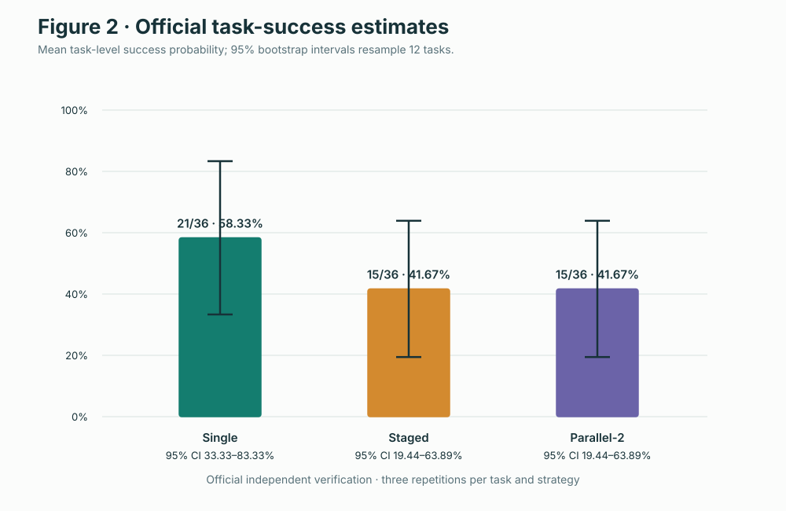
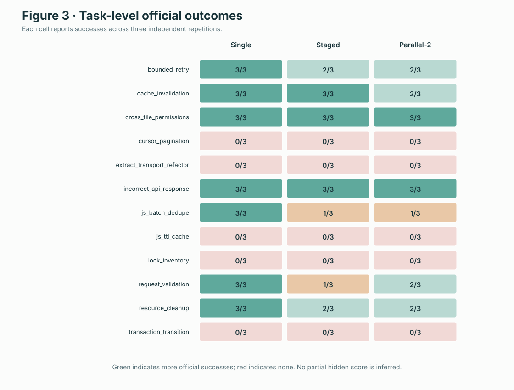
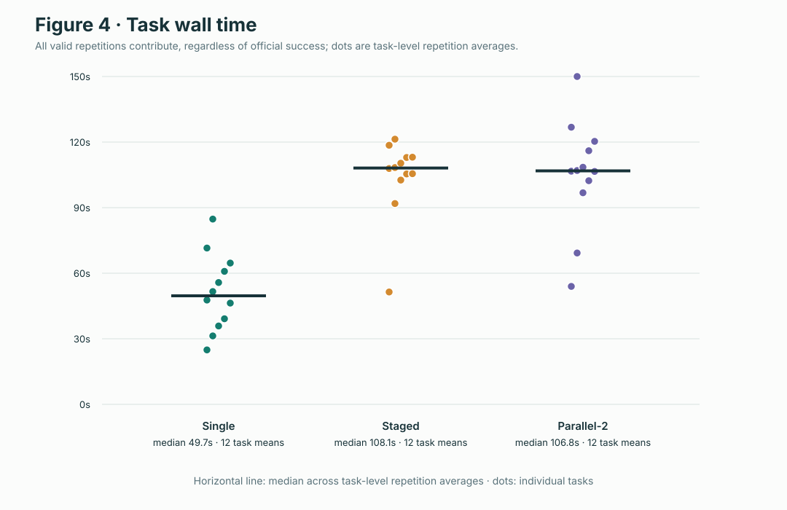
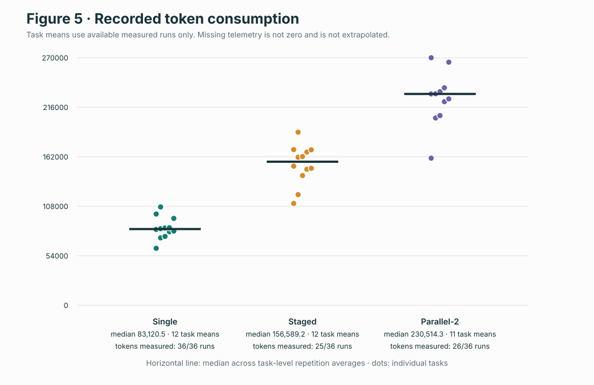
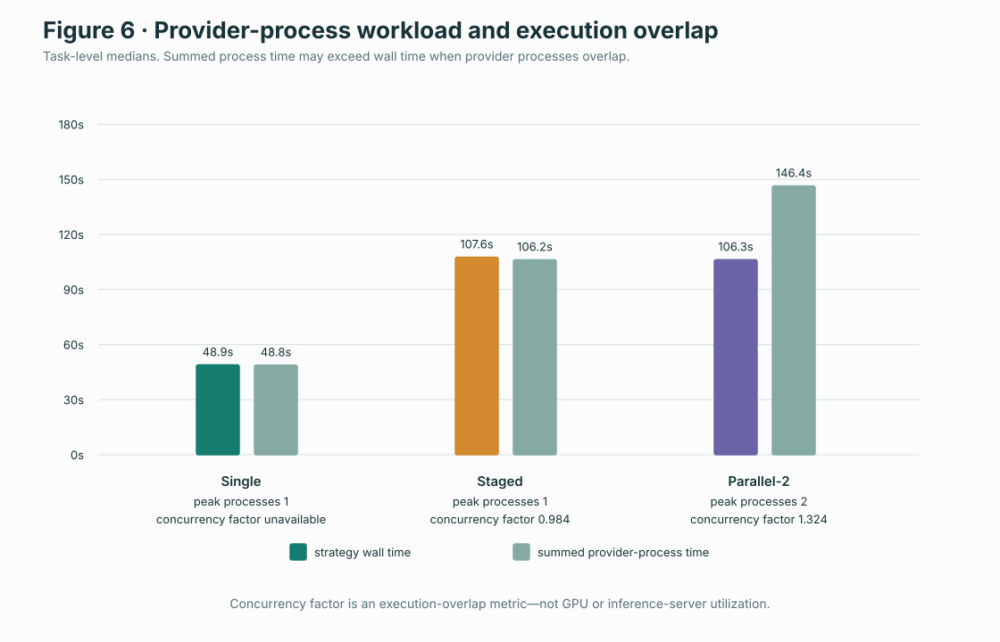
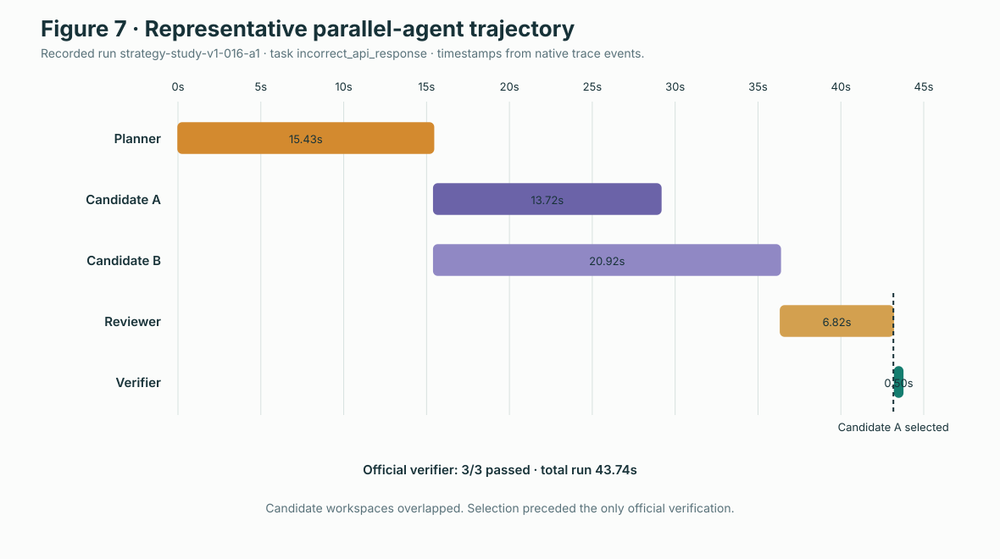

# AgentScope: Evaluating the Correctness and Inference-Workload Trade-offs of Coding-Agent Harness Architectures

## Abstract

Coding-agent behavior depends on an execution harness as well as on a model: the
harness determines repository access, tools, interaction topology, context,
parallelism, and the boundary between an agent's claims and official correctness.
AgentScope is a reproducible coding-agent harness for studying these system-level
choices. It integrates Codex CLI and Claude Code behind capability-aware adapters,
runs agents in isolated Docker workspaces, supports single, planner–implementer–
reviewer, and parallel-implementer strategies, imports Harbor-compatible tasks,
records hierarchical provider and tool telemetry, and applies an independent
verifier only after a candidate is frozen.

We used AgentScope to execute a controlled study on the frozen 12-task AgentScope
Benchmark v0.1. Codex CLI 0.154.0 was held constant across three orchestration
strategies, with three fresh repetitions per task and strategy (108 valid scheduled
runs). Single-agent execution succeeded in 21/36 runs; staged and two-implementer
parallel execution each succeeded in 15/36. Task-cluster estimates were 58.33%
(95% bootstrap CI 33.33%–83.33%) for single and 41.67% (19.44%–63.89%) for both
multi-agent strategies. The multi-agent strategies approximately doubled median
wall time and increased recorded token and tool workloads in this configuration.
These are observations on a small project-authored benchmark, not general rankings.
Token telemetry was incomplete and outcome-dependent for staged and parallel runs,
which limits complete-case resource comparisons. AgentScope observes provider
processes and tools, not GPU utilization or model-serving internals.

## 1. Introduction

Modern coding agents are interactive systems rather than single inference calls.
They inspect repositories, invoke tools, execute tests, revise files, and accumulate
context over multiple turns. A harness can add an explicit planning phase, pass a
plan into an implementer, ask another invocation to review a patch, or launch
multiple isolated implementations and select one. Each choice can change what the
provider sees, how many provider processes run, how much tool work occurs, and how
long a task takes.

Correct evaluation therefore requires more than accepting an agent's final answer.
Agent-visible tests can be incomplete, a reviewer can approve an incorrect patch,
and self-reported success does not establish benchmark correctness. AgentScope
separates candidate construction from official verification and records workload
at the same time. Its research question is not simply whether a model can solve a
task, but how harness architecture changes correctness, latency, token consumption,
tool behavior, concurrency, and failure behavior while provider and tasks are held
constant.

Parallel subagents make this distinction especially important. Two concurrent
provider processes may overlap in wall-clock time while consuming more summed
provider-process time. That overlap is observable at the harness boundary. It is
not a measurement of GPU utilization, batch efficiency, token-level serving
latency, or underlying inference throughput.

## 2. System Architecture


### 2.1 Tasks and interoperability

The benchmark catalog loads immutable native tasks with instructions, a baseline
repository, environment metadata, visible requirements, hidden verifier material,
and provenance hashes. A Harbor adapter maps the locally inspected Harbor 0.23.0
task representation into the same internal task contract. Harbor supplies task and
verification conventions; AgentScope retains ownership of orchestration, provider
configuration, telemetry, persistence, and the dashboard. A Terminal-Bench 2.1
subset was used for interoperability validation but was not pooled into the primary
Phase 9 statistics.

### 2.2 Providers and execution strategies

Provider adapters expose capabilities rather than arbitrary CLI flags. Credentials
are mounted only into provider containers, and availability is checked before a run
starts. The same execution-strategy interface implements:

- **Single:** one provider invocation works on one isolated candidate.
- **Staged:** a planner produces a structured plan, an implementer changes the
  workspace, and a reviewer approves or requests at most one correction.
- **Parallel-2:** a planner feeds two concurrent implementers in independent
  workspace copies; a reviewer selects a candidate before official verification.

Role providers are independently configurable outside the controlled study. The
primary experiment deliberately used Codex for every role so that provider identity
did not vary with strategy.

### 2.3 Isolation, tools, and verification

The harness owns a read-only baseline and creates disposable, bounded Docker
workspaces. File and command tools have typed schemas, confined paths, timeouts,
output limits, and structured trace events. Candidates cannot inspect sibling
workspaces, reference solutions, hidden tests, verifier outcomes, the Docker socket,
or database credentials.

After strategy execution, the selected patch is frozen and copied into a fresh
verifier environment. The official verifier—not an agent, planner, reviewer, or
visible test—determines the binary correctness result. Unselected parallel
candidates are never officially verified, preventing hidden benchmark ground truth
from influencing selection.

### 2.4 Telemetry, persistence, and analysis

Hierarchical executions have stable execution, parent, role, provider, and candidate
identifiers. Traces capture lifecycle, provider, tool, candidate, selection, and
verification events with sequence numbers and timestamps. Metrics distinguish task
wall time, strategy wall time, summed provider-process duration, provider
invocations, tool calls, tokens when reported, patch size, corrections, candidate
count, and peak provider-process concurrency.

PostgreSQL stores runs, traces, strategy executions, experiment specifications,
configurations, schedules, and attempts. FastAPI exposes typed task, run, strategy,
and experiment APIs. The React dashboard renders role hierarchy, candidate patches,
official verification, metrics, experiment progress, and a task-by-configuration
matrix. The experiment layer validates frozen inputs, persists a seeded randomized
schedule, resumes idempotently, and exports portable CSV/JSON/Markdown results.

## 3. Experimental Methodology

### 3.1 Frozen benchmark and treatments

AgentScope Benchmark v0.1 contains 12 frozen software-maintenance tasks: ten Python
and two TypeScript/JavaScript tasks; two are labeled easy, seven medium, and three
hard. Labels are heuristic metadata. Tasks cover API behavior, validation,
pagination, state and cache behavior, transactions, concurrency, reliability,
refactoring, and cross-file reasoning. The manifest SHA-256 is
`132a2070b12f143d889a2b88af200063800194162835bbdd3eea01aef8f38f80`.

The three treatments were single Codex, Codex planner → Codex implementer → Codex
reviewer, and Codex planner → two concurrent Codex implementers → Codex reviewer.
Every task ran three times per treatment. Every repetition started with a fresh
workspace and provider process/session. Cross-run concurrency was one; only the
parallel treatment could use two concurrent provider processes internally.

### 3.2 Schedule, validity, and outcome

The specification hash was
`bd84864140363cb6431f73118cf20f18f7ca6d4dbeccad3e05e310e1d826bf56`.
A stratified schedule was deterministically randomized with seed `20260918` to
avoid executing treatment blocks in time order. Official independent verification
was the primary binary outcome. Visible tests, reviewer decisions, and provider
self-reports were not correctness outcomes.

The validity policy was fixed before the full matrix. An official verifier failure,
an agent reaching its configured timeout, a malformed unrecoverable role output,
or an execution-local provider failure counted as a valid benchmark failure. A
database failure, harness crash, Docker outage, global provider outage, or global
authentication/rate-limit interruption was an infrastructure failure eligible for
a linked replacement. Failed benchmark outcomes were not retried for success.

The database contains 108 valid results, one excluded PostgreSQL infrastructure
attempt, and two protocol-excluded replacements. The latter followed a transparent
post-run audit of an overly broad timeout classification: the original timeouts
were restored as valid benchmark failures and the already-executed replacements
were retained but excluded. Correctness totals did not change.

### 3.3 Statistical unit

The 108 repetitions are not 108 independent benchmark problems. Runs sharing a
task can share task-specific difficulty and failure modes. Analysis therefore first
averages repetitions within each task × strategy cell and then aggregates the 12
task-level values. Confidence intervals use 10,000 nonparametric bootstrap samples
over tasks with seed `20260919`. Paired comparisons subtract task-level treatment
means for the same task before calculating mean, median, and task-bootstrap 95%
intervals. Latency and resource summaries include unsuccessful valid runs unless
explicitly labeled otherwise.

## 4. Results

### 4.1 Official correctness



| Strategy | Official successes | Mean task success | Task-bootstrap 95% CI |
| --- | ---: | ---: | ---: |
| Single Codex | 21/36 | 58.33% | 33.33%–83.33% |
| Staged Codex | 15/36 | 41.67% | 19.44%–63.89% |
| Parallel-2 Codex | 15/36 | 41.67% | 19.44%–63.89% |

These estimates apply only to AgentScope Benchmark v0.1 under the recorded
configuration. They do not establish a universal ordering of harnesses.



Three tasks—`cross_file_permissions`, `incorrect_api_response`, and, for single and
staged, `cache_invalidation`—were solved consistently or nearly consistently.
Four tasks (`cursor_pagination`, `extract_transport_refactor`, `js_ttl_cache`, and
`transaction_transition`) were unsolved by every treatment in all repetitions;
`lock_inventory` was also 0/3 for every treatment. Outcomes differed most on
`js_batch_dedupe` (3/3 single versus 1/3 staged and parallel) and
`request_validation` (3/3 single, 1/3 staged, 2/3 parallel).

### 4.2 Paired task-level comparisons

Positive values mean the left strategy has the larger metric.

| Pair | Mean success difference | Median | 95% task-bootstrap CI |
| --- | ---: | ---: | ---: |
| Single − staged | +16.67 percentage points | 0 | +2.78 to +33.33 pp |
| Parallel − single | −16.67 percentage points | 0 | −30.56 to −5.56 pp |
| Parallel − staged | approximately 0 | 0 | −8.33 to +8.33 pp |

| Pair | Mean wall difference | Median wall difference | 95% CI | Mean recorded-token difference | Median token difference | 95% CI |
| --- | ---: | ---: | ---: | ---: | ---: | ---: |
| Single − staged | −52.91 s | −56.51 s | −61.00 to −43.80 s | −69,416 | −73,183 | −82,541 to −54,974 |
| Parallel − single | +56.31 s | +59.15 s | +42.78 to +71.51 s | +146,001 | +148,432 | +129,949 to +164,703 |
| Parallel − staged | +3.40 s | +0.66 s | −7.41 to +16.81 s | +71,320 | +67,434 | +59,022 to +84,321 |

Wall comparisons include all 12 paired tasks. Token comparisons involving parallel
execution include 11 task pairs because one parallel task cell lacked a comparable
token value. The intervals describe uncertainty over this 12-task benchmark; the
study does not convert them into universal significance or superiority claims.

### 4.3 Latency, tokens, and tools



| Strategy | Mean task wall | Median | p25–p75 | Median tool calls per task mean |
| --- | ---: | ---: | ---: | ---: |
| Single | 51.20 s | 49.67 s | 38.34–61.80 s | 5.67 |
| Staged | 104.11 s | 108.13 s | 104.72–112.99 s | 9.50 |
| Parallel-2 | 107.51 s | 106.83 s | 100.94–117.11 s | 14.67 |



| Strategy | Token-complete runs | Mean task-level recorded tokens | Median | p25–p75 | Observed subtotal |
| --- | ---: | ---: | ---: | ---: | ---: |
| Single | 36/36 | 84,041 | 83,121 | 78,939–87,089 | 3,025,473 |
| Staged | 25/36 | 153,457 | 156,589 | 146,631–167,707 | 3,816,720 |
| Parallel-2 | 26/36 | 228,632 | 230,514 | 214,484–235,090 | 5,970,173 |

Task-level token means use the available measured repetitions in each cell. Staged
and parallel full-population token totals are intentionally `null`; the observed
subtotals are not extrapolated.

### 4.4 Telemetry completeness

| Strategy and outcome | Runs | Token complete | Missing |
| --- | ---: | ---: | ---: |
| Single: official success | 21 | 21 | 0 |
| Single: official verification failure | 14 | 14 | 0 |
| Single: provider API failure | 1 | 1 | 0 |
| Staged: official success | 15 | 15 | 0 |
| Staged: official verification failure | 8 | 8 | 0 |
| Staged: strategy timeout | 11 | 1 | 10 |
| Staged: provider API failure | 2 | 1 | 1 |
| Parallel-2: official success | 15 | 15 | 0 |
| Parallel-2: official verification failure | 7 | 7 | 0 |
| Parallel-2: strategy timeout | 13 | 4 | 9 |
| Parallel-2: provider API failure | 1 | 0 | 1 |

All 21 missing token observations occurred on benchmark-failure runs: 19 overall
strategy timeouts and two provider API failures. Every official success has token
telemetry. The provider emitted usable aggregate token usage only after completed
invocations; runs interrupted during a role or parallel group could retain some
session and process events without a complete strategy-level token total. Missing
values are therefore not random with respect to outcome. Complete-case token
summaries underrepresent timeout-heavy failures and may be biased downward relative
to the unobserved full-run resource demand. No missing value is replaced with zero,
and no missing total is extrapolated. True TTFT, inter-token latency, model
generation throughput, and GPU telemetry remain unavailable. AgentScope separately
records process-launch-to-first-provider-output where present and does not relabel it
as TTFT.

### 4.5 Parallel workload



| Strategy | Provider invocations | Tool calls | Median strategy wall | Median summed provider time | Peak processes | Median concurrency factor |
| --- | ---: | ---: | ---: | ---: | ---: | ---: |
| Single | 36 | 206 | 48.94 s | 48.82 s | 1 | unavailable |
| Staged | 100 | 325 | 107.61 s | 106.21 s | 1 | 0.984 |
| Parallel-2 | 135 | 499 | 106.26 s | 146.43 s | 2 | 1.324 |

For parallel execution, summed provider-process duration exceeded strategy wall time
because two implementers overlapped. The concurrency factor is
`summed provider-process duration / strategy wall time`; it is a derived harness
execution-overlap metric, not GPU efficiency or inference-server utilization.

### 4.6 Trace and candidate evidence



Figure 7 uses the native timestamps from run `strategy-study-v1-016-a1` on the easy
`incorrect_api_response` task. The planner ran for 15.43 s. Candidates A and B
started 41 microseconds apart and ran for 13.72 s and 20.92 s. The reviewer ran for
6.82 s, selected A, and the independent verifier then passed 3/3 tests in 0.50 s;
the complete run lasted 43.74 s. Both candidates produced the same 230-byte patch.
This trace demonstrates hierarchy and overlap; it was not selected as evidence that
parallel execution generally succeeds.

Across all 36 parallel runs, 34 reached records for both implementers and 31 had two
completed candidates with nonempty patches. Eleven of those candidate pairs were
textually identical and 20 differed. Reviewers selected A 18 times and B six times;
12 runs ended without selection. Textual diversity is not a quality metric, and
unselected candidates were not hidden-test verified. Three candidate executions
failed, and the mean completed-candidate count was 1.72.

Only one of 36 staged runs requested the bounded correction. It did not change the
patch, did not improve visible tests, and did not lead to official success. Because
pre-correction hidden verification was intentionally not run, the study cannot
measure hidden-test improvement from correction.

## 5. Discussion

The observed configuration added substantial orchestration work without a measured
correctness improvement. Staged execution introduced planner and reviewer contexts;
parallel execution added another implementer and selection context. That is visible
in invocation totals (36, 100, and 135), tool calls (206, 325, and 499), token
summaries, and wall time. Parallelism overlapped provider processes, but planner and
reviewer stages remained serial, so its wall time was close to staged while summed
provider time was higher.

Several explanations are plausible but not established causally by this study.
Plans may not have added useful information for tasks that a single implementation
could solve directly. Review prompts and larger accumulated contexts may have
increased overhead. Parallel candidates sometimes converged on identical patches,
limiting diversity, while different patches still depended on a reviewer operating
without hidden ground truth. Multi-role runs also approached configured timeouts
more often. These are hypotheses supported by trace patterns, not claims about
model motives or all multi-agent systems.

The consistently unsolved tasks suggest benchmark-specific capability or harness
limits that orchestration alone did not overcome. Conversely, `js_batch_dedupe` and
`request_validation` show that additional stages can coincide with different task
outcomes even when the provider is held constant. Twelve tasks are too few to infer
which task properties moderate strategy effects reliably.

## 6. Limitations

- The benchmark contains only 12 tasks authored as part of AgentScope; it is not a
  representative sample of all software-engineering workloads.
- Language coverage is ten Python and two TypeScript/JavaScript tasks, and difficulty
  labels are heuristic.
- Three repetitions provide limited characterization of stochastic behavior.
- Provider and CLI behavior may change across model and software versions.
- The study used Codex CLI 0.154.0; the planned Claude comparison was not executed
  because authentication was unavailable.
- Local Docker, machine, network, provider load, and time of day affect latency.
- Token telemetry is outcome-dependent and incomplete for staged and parallel runs.
- True TTFT, ITL, generation throughput, GPU utilization, power, memory bandwidth,
  and inference-server batching are not measured.
- Unselected parallel candidates are intentionally not officially verified, so
  reviewer selection quality against hidden ground truth is unknown.
- A single bounded correction occurred, providing almost no evidence about correction
  effectiveness.
- Infrastructure exclusions and the timeout-classification audit are transparent,
  but they illustrate the sensitivity of studies to predeclared validity policy.
- Results should not be generalized beyond this benchmark, provider version, harness
  implementation, and recorded configuration.

## 7. Future Work

Future studies could preregister and run a larger externally authored task set,
increase the number of independent tasks before increasing repetitions, and examine
task properties that may interact with planning or candidate diversity. Separate
controlled studies could vary provider, model, context policy, reviewer information,
or worker count one factor at a time. Provider APIs with request-level usage and
token timestamps could improve telemetry completeness and support true TTFT/ITL
measurement. A serving-side study could join harness traces with authorized GPU and
inference-server telemetry, while keeping those hardware measurements distinct from
AgentScope's process-overlap metrics. Selection research would require an evaluation
design that does not leak hidden verification into the strategy.

## 8. Conclusion

AgentScope establishes an end-to-end methodology for studying coding-agent harnesses:
frozen tasks, isolated workspaces, capability-aware providers, hierarchical traces,
candidate selection before independent verification, immutable experiment schedules,
and task-cluster statistical analysis. On AgentScope Benchmark v0.1, the recorded
staged and two-implementer parallel configurations increased latency and observed
provider workload but did not improve official success relative to the recorded
single-agent configuration. That observation is bounded to 12 tasks and incomplete
multi-agent token telemetry. The broader contribution is the measurement boundary:
agent orchestration, workload, and correctness can be studied together without
confusing self-reported success, process concurrency, or visible tests with official
benchmark correctness or hardware-level inference performance.

## Reproducibility note

The figures and publication summaries are regenerated offline with:

```bash
PYTHON=.venv/bin/python make research-artifacts
```

The command reads the frozen files under `results/strategy-study-v1/`, reruns the
existing seeded task-cluster analysis, refuses to continue if it differs from the
checked-in strategy or pairwise summaries, and invokes no provider or database.
Source hashes and validation status are recorded in
`docs/figures/analysis-validation.json`; the regenerated consolidated summary is
`results/strategy-study-v1/publication_analysis.json`.
